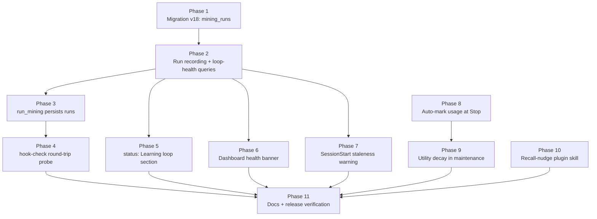

# v0.8.0 Loop Observability Implementation Plan

> **For agentic workers:** REQUIRED SUB-SKILL: Use superpowers:subagent-driven-development (recommended) or superpowers:executing-plans to implement this plan task-by-task. Steps use checkbox (`- [ ]`) syntax for tracking.

**Goal:** Make the Stop-hook learning loop observable, loud on failure, and self-correcting on quality, per the approved spec [2026-07-01-v0.8-loop-observability-design.md](../../../docs/superpowers/specs/2026-07-01-v0.8-loop-observability-design.md).

**Architecture:** A new `mining_runs` table (migration v18) becomes the single source of truth for loop health. `run_mining` persists every run; `hook-check` gains a live round-trip probe; `status`, the dashboard mining page, and the SessionStart bootstrap all read the same health queries. Usage tracking closes the utility feedback loop: `log-response` marks injected memories used, and maintenance decays mined-but-never-used memories.

**Tech Stack:** Python 3.11+, SQLite (mixin-based `Storage`), Click CLI, FastAPI + Jinja2 dashboard, pytest, uv.

## Global Constraints

Copied verbatim from the spec and repo conventions. Every task's requirements implicitly include this section.

- Accepted defaults (spec, binding): staleness **7 days**, decay **30 days**, error streak for red/warning **3 runs**, auto-mark heuristic v1 = **distinctive-token substring match**.
- Zero-config: "The system must work out of the box with no configuration. This is non-negotiable." (repo CLAUDE.md). Every v0.8 feature defaults on.
- Data changes limited to: new table `mining_runs`. No changes to existing columns.
- Decay deletes nothing. Only the probe hard-deletes, and only its own artifacts.
- The Stop hook keeps its must-never-break-Claude `|| true`.
- `run-mining` must NOT regain a `--session-id` CLI flag (the historic bug; `tests/test_hook.py:846` guards this). A Python-level `session_id` parameter is fine.
- TDD: failing test first for every behavior. No `--quiet`/`-q` flags on any command you run or write (the pre-existing `bootstrap -q` flag stays; do not add new ones).
- Google-style docstrings. Mermaid-only diagrams. Changelog entries under `[Unreleased]`.
- Commit after every green task. No AI attribution in commits. Push at the end of each phase.
- Non-goals (do not touch): mqa, summarization, git forensics, rebrand, md-recall fold-in.

## Context

The learning loop (log response → mine patterns → promote memories) silently failed for five months because `hook-check` only verified prerequisites, not the loop. The call-chain bugs are fixed (fd8448c). v0.8.0 makes this failure class impossible to miss: the probe catches wiring bugs on day one, `mining_runs` catches runtime errors, staleness detection catches silent absence, and utility decay makes mined memories earn their place.

## Scope

**In:** spec sections A (probe), B (`mining_runs` + status + dashboard banner), C (SessionStart warning), D (auto-mark + decay), E (recall-nudge skill), plus changelog and doc updates.

**Out:** everything in the spec's Non-goals; the 0.8.0 version bump and release cut (`./scripts/bump-version.sh` + `/release` run separately after this plan lands); pytest-xdist/randomly/timeout adoption (test-infra change, separate PR if wanted).

## Spec deviations and resolutions

The spec leaves seven points open. Resolutions below are design decisions of this plan; revisit only with evidence.

1. **Probe vs `mining_runs`.** If the probe's synchronous mining recorded a run, a passing probe would reset the staleness clock and mask the "silent absence" signal staleness exists to catch. The spec's cleanup list also omits the run row, and the spec-listed columns give a probe marker nowhere to live. Resolution: probe-scoped mining passes `record_run=False` and never writes `mining_runs`. Probe failures report via `hook-check` output with stage attribution instead.
2. **Probe marker mechanics.** "Reserved probe marker" is not located. Resolution: the output row carries reserved `session_id = "memory-mcp-probe"`; pattern/memory rows are identified by a unique nonce embedded in the sentinel content. Health/stats queries exclude the probe session; pattern/memory stats are immune by construction because they derive from `mining_runs` sums, which the probe never writes.
3. **Once-per-day rate-limit state.** Spec is silent on where it lives, and a new state table would violate the spec's Data changes section. Resolution: a stamp file `loop-warning.stamp` next to the DB, mtime-checked, touched only when a warning is emitted.
4. **"Produced" for green/amber.** Section B says green = "produced within 7 days"; section C says stale = "no successful run in 7 days". Resolution: one definition, C's — a successful run is a `mining_runs` row with `error IS NULL`. A healthy-but-quiet week (successful runs, zero new memories) stays green.
5. **`mined_approved` and decay.** Spec exempts "source != mining". `MemorySource.MINED_APPROVED` exists (`models.py:36`) for approved candidates; approval is a human signal. Resolution: decay targets `source = 'mined'` only.
6. **Utility floor value.** Spec says "floored" without a number. Resolution: `utility_score = 0.0` (v16 default is 0.25).
7. **Probe runs the full pipeline.** `run_mining`'s auto-promote stage processes all pending candidates, so a probe may legitimately promote unrelated real patterns that were already due. This mirrors a real run and is accepted; no skip flag is added.

## Alternatives considered

- **Recording runs at call sites vs inside `run_mining`.** Inside wins: every caller (CLI, detached hook spawn, dashboard `POST /api/mining/run`, probe) is covered by one source of truth, and the error path is capturable where the exception is raised.
- **New `MiningRunsMixin` vs extending `MiningStoreMixin`.** New mixin wins: `Storage` already composes 15 focused mixins (`core.py:46`); loop-health queries serve status/dashboard/bootstrap, a different concern from pattern CRUD.
- **Probe marker as content-LIKE filter in every stats query vs reserved session + runs-derived stats.** The latter wins: one SQL filter on `output_log`, zero filters elsewhere, and a pre-sweep at probe start bounds leftover pollution.

## Phases



Phases 8-10 are independent of 1-7 and of each other; run them in any order after Phase 2 exists (Phase 8-10 have no dependency on it, but sequential execution keeps the suite green throughout).

## Applicable skills

- **superpowers:test-driven-development** for every task (failing test first).
- **plugin-dev:skill-development** for Phase 10 (authoring the SKILL.md).
- Claude Code's **run** skill for CLI runtime verification (Phases 4, 5, 7); **verify** skill for the dashboard page (Phase 6).
- **pstack:deslop** (`/deslop`) over each diff before commit; **pstack:unslop** over prose surfaces (SKILL.md, changelog, docs).
- **pstack:how** before modifying `mining.py` or the dashboard if unfamiliar; **pstack:babysit** after opening the PR if one is opened instead of direct pushes.

## Verification (project level)

```bash
uv run pytest                 # full suite; baseline 671 passed, 2 skipped at fd8448c
uv run ruff check .
uv run ruff format .
```

Runtime proof on a scratch DB (Phase 11): `hook-check` probe green end-to-end, `status` renders the Learning loop section, dashboard `/mining` shows the banner, `bootstrap` on a stale DB prints the warning.

---

## Phase 1: Migration v18 — `mining_runs` table

### Task 1.1: Create the `mining_runs` table

**Files:**
- Modify: `src/memory_mcp/migrations.py` (SCHEMA_VERSION at `:15`, new function after `migrate_v16_to_v17` at `:531`, guard in `run_migrations` after the `< 17` block at `:583`)
- Test: `tests/test_loop_observability.py` (new file)

**Interfaces:**
- Produces: table `mining_runs(id INTEGER PK, started_at TEXT NOT NULL, finished_at TEXT, outputs_processed INTEGER DEFAULT 0, patterns_found INTEGER DEFAULT 0, memories_created INTEGER DEFAULT 0, error TEXT)` — exactly the spec's columns. `SCHEMA_VERSION == 18`.

Base `SCHEMA` in `migrations.py` is the v1 schema; fresh DBs replay the whole migration chain, so the new table goes in the migration only, not in `SCHEMA`.

- [ ] **Step 1: Write the failing tests**

```python
"""Tests for v0.8 loop observability: mining_runs, probe, health, decay."""

from memory_mcp.migrations import SCHEMA_VERSION
from memory_mcp.storage import Storage


class TestMiningRunsMigration:
    def _columns(self, storage, table):
        with storage._connection() as conn:
            rows = conn.execute(f"PRAGMA table_info({table})").fetchall()
        return {row[1] for row in rows}

    # Mirror the Storage import used by tests/test_storage.py if the package
    # __init__ does not re-export it.

    def test_fresh_db_has_mining_runs_table(self, temp_settings):
        storage = Storage(temp_settings)
        try:
            cols = self._columns(storage, "mining_runs")
            assert cols == {
                "id", "started_at", "finished_at", "outputs_processed",
                "patterns_found", "memories_created", "error",
            }
            assert storage.get_schema_version() == SCHEMA_VERSION
        finally:
            storage.close()

    def test_v17_db_gains_table_on_reopen(self, temp_settings):
        storage = Storage(temp_settings)
        with storage.transaction() as conn:
            conn.execute("DROP TABLE mining_runs")
            conn.execute("DELETE FROM schema_version")
            conn.execute("INSERT INTO schema_version (version) VALUES (17)")
        storage.close()

        storage = Storage(temp_settings)
        try:
            assert "started_at" in self._columns(storage, "mining_runs")
            assert storage.get_schema_version() == SCHEMA_VERSION
        finally:
            storage.close()
```

`temp_settings` comes from `tests/conftest.py:75`; the autouse `mock_embedding_engine` fixture (`conftest.py:52`) applies automatically.

- [ ] **Step 2: Run tests to verify they fail**

Run: `uv run pytest tests/test_loop_observability.py -v`
Expected: FAIL — `sqlite3.OperationalError: no such table: mining_runs` (and `SCHEMA_VERSION` is still 17).

- [ ] **Step 3: Write the migration**

In `src/memory_mcp/migrations.py`: bump `SCHEMA_VERSION = 18` at line 15. After `migrate_v16_to_v17`, add (matching the v17 shape and its `log.info` convention):

```python
def migrate_v17_to_v18(conn: sqlite3.Connection) -> None:
    """Add mining_runs table for learning-loop observability (v18)."""
    conn.execute("""
        CREATE TABLE IF NOT EXISTS mining_runs (
            id INTEGER PRIMARY KEY,
            started_at TEXT NOT NULL,
            finished_at TEXT,
            outputs_processed INTEGER DEFAULT 0,
            patterns_found INTEGER DEFAULT 0,
            memories_created INTEGER DEFAULT 0,
            error TEXT
        )
    """)
    conn.execute(
        "CREATE INDEX IF NOT EXISTS idx_mining_runs_started ON mining_runs(started_at)"
    )
    log.info("Added mining_runs table (v18)")
```

In `run_migrations`, after the `if from_version < 17:` block:

```python
    if from_version < 18:
        migrate_v17_to_v18(conn)
```

- [ ] **Step 4: Run tests to verify they pass**

Run: `uv run pytest tests/test_loop_observability.py -v`
Expected: 2 PASS.

- [ ] **Step 5: Run the schema-version regression tests**

Run: `uv run pytest tests/test_storage.py -k schema_version tests/test_bug_regressions.py -k schema -v`
Expected: PASS (they compare against the imported `SCHEMA_VERSION` constant, no literals).

- [ ] **Step 6: Commit**

```bash
git add src/memory_mcp/migrations.py tests/test_loop_observability.py
git commit -m "feat: add mining_runs table (schema v18)"
```

**Phase 1 verification:** `uv run pytest tests/test_loop_observability.py tests/test_storage.py -v` all green.

---

## Phase 2: `MiningRunsMixin` — run recording and loop health

### Task 2.1: Record runs and compute health

**Files:**
- Create: `src/memory_mcp/storage/mining_runs.py`
- Modify: `src/memory_mcp/storage/core.py` (import at `:26-41` block, base list at `:46`)
- Test: `tests/test_loop_observability.py`

**Interfaces:**
- Produces (consumed by Phases 3-7):

```python
# src/memory_mcp/storage/mining_runs.py module constants
STALENESS_DAYS = 7          # spec accepted default
ERROR_STREAK = 3            # spec accepted default
PROBE_SESSION_ID = "memory-mcp-probe"

class MiningRunsMixin:
    def record_mining_run(
        self,
        started_at: str,
        finished_at: str,
        stats: dict,            # reads keys: outputs_processed, patterns_found, new_memories
        error: str | None = None,
    ) -> int: ...               # returns row id

    def get_loop_health(self) -> dict:
        # {"state": "green"|"amber"|"red",
        #  "last_success_at": str | None, "last_run_at": str | None,
        #  "consecutive_errors": int, "total_runs": int,
        #  "outputs_24h": int, "outputs_7d": int,
        #  "patterns_7d": int, "memories_7d": int,
        #  "days_since_success": int | None}
```

State logic, in precedence order: **red** if the most recent `ERROR_STREAK` runs all have `error NOT NULL` (requires at least 3 runs); **amber** if `last_success_at` is `None` or older than `STALENESS_DAYS`; **green** otherwise. `outputs_24h`/`outputs_7d` count `output_log` rows excluding `session_id = PROBE_SESSION_ID`. `patterns_7d`/`memories_7d` are `SUM(patterns_found)`/`SUM(memories_created)` over successful runs in the window — immune to probe pollution by construction (deviation 1). Timestamps: store and compare in the same format `output_log` uses (`CURRENT_TIMESTAMP`-style UTC); copy the cutoff idiom from `get_recent_outputs` (`storage/output_logging.py:73`). Reads use `with self._connection() as conn:`, writes `with self.transaction() as conn:` (house pattern, `storage/core.py:124/:196`).

- [ ] **Step 1: Write the failing tests**

Append to `tests/test_loop_observability.py`:

```python
from datetime import datetime, timedelta, timezone

from memory_mcp.storage.mining_runs import PROBE_SESSION_ID


def _ts(days_ago: float = 0) -> str:
    dt = datetime.now(timezone.utc) - timedelta(days=days_ago)
    return dt.strftime("%Y-%m-%d %H:%M:%S")


class TestMiningRunRecording:
    def test_records_successful_run(self, temp_settings):
        storage = Storage(temp_settings)
        try:
            run_id = storage.record_mining_run(
                started_at=_ts(), finished_at=_ts(),
                stats={"outputs_processed": 4, "patterns_found": 2, "new_memories": 1},
            )
            with storage._connection() as conn:
                row = conn.execute(
                    "SELECT outputs_processed, patterns_found, memories_created, error"
                    " FROM mining_runs WHERE id = ?", (run_id,)
                ).fetchone()
            assert tuple(row) == (4, 2, 1, None)
        finally:
            storage.close()

    def test_records_failed_run(self, temp_settings):
        storage = Storage(temp_settings)
        try:
            storage.record_mining_run(
                started_at=_ts(), finished_at=_ts(), stats={}, error="boom"
            )
            with storage._connection() as conn:
                row = conn.execute("SELECT error FROM mining_runs").fetchone()
            assert row[0] == "boom"
        finally:
            storage.close()


class TestLoopHealth:
    def _seed_run(self, storage, days_ago, error=None):
        storage.record_mining_run(
            started_at=_ts(days_ago), finished_at=_ts(days_ago),
            stats={"outputs_processed": 1, "patterns_found": 1, "new_memories": 1},
            error=error,
        )

    def test_empty_db_is_amber(self, temp_settings):
        storage = Storage(temp_settings)
        try:
            health = storage.get_loop_health()
            assert health["state"] == "amber"
            assert health["last_success_at"] is None
        finally:
            storage.close()

    def test_recent_success_is_green(self, temp_settings):
        storage = Storage(temp_settings)
        try:
            self._seed_run(storage, days_ago=1)
            assert storage.get_loop_health()["state"] == "green"
        finally:
            storage.close()

    def test_stale_success_is_amber(self, temp_settings):
        storage = Storage(temp_settings)
        try:
            self._seed_run(storage, days_ago=8)
            health = storage.get_loop_health()
            assert health["state"] == "amber"
            assert health["days_since_success"] >= 8
        finally:
            storage.close()

    def test_error_streak_is_red(self, temp_settings):
        storage = Storage(temp_settings)
        try:
            self._seed_run(storage, days_ago=2)          # old success
            for _ in range(3):
                self._seed_run(storage, days_ago=0, error="boom")
            health = storage.get_loop_health()
            assert health["state"] == "red"
            assert health["consecutive_errors"] == 3
        finally:
            storage.close()

    def test_probe_outputs_excluded_from_counts(self, temp_settings):
        storage = Storage(temp_settings)
        try:
            storage.log_output("real output content", session_id="real-session")
            storage.log_output("probe sentinel content", session_id=PROBE_SESSION_ID)
            health = storage.get_loop_health()
            assert health["outputs_24h"] == 1
            assert health["outputs_7d"] == 1
        finally:
            storage.close()
```

- [ ] **Step 2: Run tests to verify they fail**

Run: `uv run pytest tests/test_loop_observability.py -v`
Expected: new tests FAIL with `ModuleNotFoundError` / `AttributeError: record_mining_run`.

- [ ] **Step 3: Implement the mixin**

Create `src/memory_mcp/storage/mining_runs.py` implementing the interface block above (Google-style docstrings; SQL per the state logic above; `consecutive_errors` computed in Python over the last `ERROR_STREAK` rows ordered by `id DESC`). Wire into `Storage`: add the import alongside the others in `storage/core.py:26-41` and `MiningRunsMixin` to the class bases at `:46`.

- [ ] **Step 4: Run tests to verify they pass**

Run: `uv run pytest tests/test_loop_observability.py -v`
Expected: all PASS.

- [ ] **Step 5: Commit**

```bash
git add src/memory_mcp/storage/mining_runs.py src/memory_mcp/storage/core.py tests/test_loop_observability.py
git commit -m "feat: record mining runs and compute loop health"
```

**Phase 2 verification:** `uv run pytest tests/test_loop_observability.py tests/test_storage.py -v` green; `uv run ruff check .` clean.

---

## Phase 3: `run_mining` persists runs and accepts scoping

### Task 3.1: Record every run from inside `run_mining`

**Files:**
- Modify: `src/memory_mcp/mining.py` (`run_mining` at `:1244`)
- Modify: `src/memory_mcp/storage/output_logging.py` (`get_recent_outputs` at `:73`)
- Test: `tests/test_loop_observability.py`

**Interfaces:**
- Consumes: `record_mining_run` (Task 2.1).
- Produces (consumed by Phase 4):

```python
def run_mining(
    storage: Storage,
    hours: int = 24,
    project_id: str | None = None,
    session_id: str | None = None,   # NEW: scope to one session's outputs
    record_run: bool = True,          # NEW: probe passes False
) -> dict: ...                        # return shape unchanged

def get_recent_outputs(
    self, hours: int = 24, project_id: str | None = None,
    session_id: str | None = None,    # NEW: exact-match filter when set
) -> list[tuple[int, str, datetime, str | None, str | None]]: ...
```

The CLI surface does NOT change: `run-mining` keeps only `--hours`/`--project-id` (Global Constraints; `tests/test_hook.py:846` guards the absent `--session-id`).

- [ ] **Step 1: Write the failing tests**

Append to `tests/test_loop_observability.py`:

```python
import pytest
from unittest.mock import patch

from memory_mcp.mining import run_mining


def _count_runs(storage) -> int:
    with storage._connection() as conn:
        return conn.execute("SELECT COUNT(*) FROM mining_runs").fetchone()[0]


class TestRunMiningPersistence:
    def test_successful_run_is_recorded(self, temp_settings):
        storage = Storage(temp_settings)
        try:
            storage.log_output("import numpy as np", session_id="s1")
            result = run_mining(storage, hours=1)
            with storage._connection() as conn:
                row = conn.execute(
                    "SELECT outputs_processed, patterns_found, memories_created, error"
                    " FROM mining_runs"
                ).fetchone()
            assert row[0] == result["outputs_processed"]
            assert row[1] == result["patterns_found"]
            assert row[2] == result["new_memories"]
            assert row[3] is None
        finally:
            storage.close()

    def test_failed_run_records_error_and_reraises(self, temp_settings):
        storage = Storage(temp_settings)
        try:
            storage.log_output("import numpy as np", session_id="s1")
            with patch(
                "memory_mcp.mining.extract_patterns",
                side_effect=RuntimeError("extractor exploded"),
            ):
                with pytest.raises(RuntimeError):
                    run_mining(storage, hours=1)
            with storage._connection() as conn:
                row = conn.execute("SELECT error FROM mining_runs").fetchone()
            assert "extractor exploded" in row[0]
        finally:
            storage.close()

    def test_record_run_false_writes_nothing(self, temp_settings):
        storage = Storage(temp_settings)
        try:
            run_mining(storage, hours=1, record_run=False)
            assert _count_runs(storage) == 0
        finally:
            storage.close()

    def test_session_id_scopes_outputs(self, temp_settings):
        storage = Storage(temp_settings)
        try:
            storage.log_output("import alpha_only_lib", session_id="s-alpha")
            storage.log_output("import beta_only_lib", session_id="s-beta")
            result = run_mining(storage, hours=1, session_id="s-alpha", record_run=False)
            assert result["outputs_processed"] == 1
        finally:
            storage.close()
```

- [ ] **Step 2: Run tests to verify they fail**

Run: `uv run pytest tests/test_loop_observability.py::TestRunMiningPersistence -v`
Expected: FAIL — `TypeError: run_mining() got an unexpected keyword argument` and no `mining_runs` rows.

- [ ] **Step 3: Implement**

In `output_logging.py`, add the `session_id` parameter to `get_recent_outputs` and an `AND session_id = ?` clause when set. In `mining.py`, capture `started_at` at entry, pass `session_id` through to `get_recent_outputs`, and wrap the existing body:

```python
    started_at = _utc_now_str()
    try:
        ...existing body, building the stats dict...
    except Exception as e:
        if record_run:
            storage.record_mining_run(
                started_at=started_at, finished_at=_utc_now_str(),
                stats={}, error=f"{type(e).__name__}: {e}",
            )
        raise
    if record_run:
        storage.record_mining_run(
            started_at=started_at, finished_at=_utc_now_str(), stats=stats
        )
    return stats
```

`_utc_now_str` is a small module helper matching the timestamp format chosen in Task 2.1. Keep the recording call outside the mined-transaction path so a recording failure cannot corrupt mining results.

- [ ] **Step 4: Run tests to verify they pass**

Run: `uv run pytest tests/test_loop_observability.py tests/test_mining.py -v`
Expected: PASS, including the pre-existing mining suite.

- [ ] **Step 5: Commit**

```bash
git add src/memory_mcp/mining.py src/memory_mcp/storage/output_logging.py tests/test_loop_observability.py
git commit -m "feat: persist mining run outcomes from run_mining"
```

**Phase 3 verification:** `uv run pytest tests/test_mining.py tests/test_hook.py tests/test_loop_observability.py -v` green (hook tests prove the CLI surface is unchanged).

---

## Phase 4: Round-trip probe in `hook-check`

### Task 4.1: The probe module

**Files:**
- Create: `src/memory_mcp/probe.py`
- Test: `tests/test_loop_observability.py`

**Interfaces:**
- Consumes: `PROBE_SESSION_ID` (Task 2.1), `run_mining(..., session_id=, record_run=False)` (Task 3.1), `storage.log_output` (`output_logging.py:21`), `storage.delete_memory` (`memory_crud.py:758`).
- Produces (consumed by Task 4.2):

```python
@dataclass
class ProbeResult:
    ok: bool
    stage: str                 # "" on success; "log"|"mine"|"assert"|"cleanup" on failure
    error: str | None = None
    details: dict = field(default_factory=dict)

def run_probe(storage: Storage) -> ProbeResult: ...
```

Probe flow (each stage in its own try/except that returns `ProbeResult(ok=False, stage=..., error=f"{type(e).__name__}: {e}")`):

1. **Pre-sweep** (idempotent, part of no stage — failures here report as `"cleanup"`): delete leftovers from any prior failed probe using the same deletions as step 5.
2. **log**: `nonce = uuid4().hex[:8]`; `sentinel = f"import memory_probe_{nonce}"` (import-shaped so `extract_patterns` reliably mines it; short nonce so `redact_secrets` at `output_logging.py:43` never flags it); `log_id = storage.log_output(sentinel, session_id=PROBE_SESSION_ID)`.
3. **mine**: `run_mining(storage, hours=1, session_id=PROBE_SESSION_ID, record_run=False)`.
4. **assert**: a `mined_patterns` row with `pattern LIKE '%' || nonce || '%'` exists (pattern-level is deterministic; memory creation depends on the confidence threshold, so assert it only if present).
5. **cleanup**: `storage.delete_memory(id)` for every memory with `content LIKE '%' || nonce || '%'` (cascades vectors/tags); `DELETE FROM mined_patterns WHERE pattern LIKE ...`; `DELETE FROM output_log WHERE session_id = ?` (probe session); then verify residue is zero and put counts in `details`.

- [ ] **Step 1: Write the failing tests**

```python
from memory_mcp.probe import ProbeResult, run_probe


def _residue(storage) -> tuple[int, int, int]:
    with storage._connection() as conn:
        outputs = conn.execute(
            "SELECT COUNT(*) FROM output_log WHERE session_id = ?", (PROBE_SESSION_ID,)
        ).fetchone()[0]
        patterns = conn.execute(
            "SELECT COUNT(*) FROM mined_patterns WHERE pattern LIKE '%memory_probe_%'"
        ).fetchone()[0]
        memories = conn.execute(
            "SELECT COUNT(*) FROM memories WHERE content LIKE '%memory_probe_%'"
        ).fetchone()[0]
    return outputs, patterns, memories


class TestProbe:
    def test_round_trip_succeeds_on_clean_db(self, temp_settings):
        storage = Storage(temp_settings)
        try:
            result = run_probe(storage)
            assert result.ok, f"failed at {result.stage}: {result.error}"
        finally:
            storage.close()

    def test_no_residue_after_success(self, temp_settings):
        storage = Storage(temp_settings)
        try:
            run_probe(storage)
            assert _residue(storage) == (0, 0, 0)
            assert _count_runs(storage) == 0     # deviation 1: never records a run
        finally:
            storage.close()

    def test_failure_reports_stage(self, temp_settings):
        storage = Storage(temp_settings)
        try:
            with patch("memory_mcp.probe.run_mining", side_effect=RuntimeError("wiring")):
                result = run_probe(storage)
            assert not result.ok
            assert result.stage == "mine"
            assert "wiring" in result.error
        finally:
            storage.close()

    def test_leftovers_excluded_from_health_and_swept_by_next_probe(self, temp_settings):
        storage = Storage(temp_settings)
        try:
            with patch("memory_mcp.probe.run_mining", side_effect=RuntimeError("wiring")):
                run_probe(storage)                       # leaves the sentinel output behind
            assert storage.get_loop_health()["outputs_24h"] == 0   # marker excluded
            result = run_probe(storage)                  # pre-sweep + fresh round trip
            assert result.ok
            assert _residue(storage) == (0, 0, 0)
        finally:
            storage.close()
```

- [ ] **Step 2: Run tests to verify they fail**

Run: `uv run pytest tests/test_loop_observability.py::TestProbe -v`
Expected: FAIL — `ModuleNotFoundError: memory_mcp.probe`.

- [ ] **Step 3: Implement `probe.py` per the flow above**

- [ ] **Step 4: Run tests to verify they pass**

Run: `uv run pytest tests/test_loop_observability.py -v`
Expected: all PASS.

- [ ] **Step 5: Commit**

```bash
git add src/memory_mcp/probe.py tests/test_loop_observability.py
git commit -m "feat: add learning-loop round-trip probe"
```

### Task 4.2: Wire the probe into `hook-check`

**Files:**
- Modify: `src/memory_mcp/cli.py` (`hook_check` at `:904`)
- Test: `tests/test_cli.py`

**Interfaces:**
- Consumes: `run_probe`/`ProbeResult` (Task 4.1).
- Produces: `hook-check --no-probe` flag; a new `loop_probe` entry in the existing `checks` list; exit 1 when the probe fails (existing exit logic at `cli.py:993`).

Probe runs by default, only when the `database` check passed (a probe against a broken DB is noise), and is skipped by `--no-probe`. Failure message: `f"stage={result.stage}: {result.error}"`. Success message: `"round trip ok"`.

- [ ] **Step 1: Write the failing tests** (in `tests/test_cli.py`, following the house `sys.argv` + `main()` pattern at `test_cli.py:27`)

```python
class TestHookCheckProbe:
    def test_probe_runs_by_default_and_passes(self, temp_db, capsys):
        with patch("sys.argv", ["memory-mcp-cli", "--json", "hook-check"]):
            result = main()
        checks = {c["name"]: c for c in json.loads(capsys.readouterr().out)["checks"]}
        assert "loop_probe" in checks
        assert checks["loop_probe"]["ok"]
        assert result == 0

    def test_no_probe_skips(self, temp_db, capsys):
        with patch("sys.argv", ["memory-mcp-cli", "--json", "hook-check", "--no-probe"]):
            main()
        names = [c["name"] for c in json.loads(capsys.readouterr().out)["checks"]]
        assert "loop_probe" not in names

    def test_probe_failure_fails_hook_check(self, temp_db, capsys):
        with patch("memory_mcp.cli.run_probe") as mock_probe:
            from memory_mcp.probe import ProbeResult
            mock_probe.return_value = ProbeResult(ok=False, stage="mine", error="boom")
            with patch("sys.argv", ["memory-mcp-cli", "--json", "hook-check"]):
                result = main()
        assert result != 0
        out = json.loads(capsys.readouterr().out)
        assert not out["success"]
        probe = [c for c in out["checks"] if c["name"] == "loop_probe"][0]
        assert "stage=mine" in probe["message"]
```

Note: `test_probe_runs_by_default_and_passes` may need the other prerequisite checks (uv/jq/hook script) to be present on the dev machine; assert only on the `loop_probe` entry and overall behavior, and mirror how existing hook-check behavior is (un)tested — these are the first hook-check tests in the suite.

- [ ] **Step 2: Run tests to verify they fail**

Run: `uv run pytest tests/test_cli.py::TestHookCheckProbe -v`
Expected: FAIL — no `loop_probe` check, `--no-probe` unknown option.

- [ ] **Step 3: Implement the flag and check entry in `hook_check`**

- [ ] **Step 4: Run tests to verify they pass**

Run: `uv run pytest tests/test_cli.py -v`
Expected: PASS.

- [ ] **Step 5: Commit**

```bash
git add src/memory_mcp/cli.py tests/test_cli.py
git commit -m "feat: run the loop probe from hook-check"
```

**Phase 4 verification (runtime, prove-it-works):** on a scratch DB via the **run** skill: `MEMORY_MCP_DB_PATH=/tmp/probe-test.db uv run memory-mcp-cli hook-check` shows `loop_probe` green; re-run with `--no-probe` skips it. Then break it deliberately — `chmod 444 /tmp/probe-test.db` and re-run — and confirm the probe failure names a stage instead of passing green.

---

## Phase 5: `status` — Learning loop section

### Task 5.1: Add the section

**Files:**
- Modify: `src/memory_mcp/cli.py` (`status` at `:800`)
- Test: `tests/test_cli.py`

**Interfaces:**
- Consumes: `storage.get_loop_health()` (Task 2.1).
- Produces: JSON key `"learning_loop"` (the health dict verbatim); a Rich "Learning Loop:" table after the Memory Overview table with rows: State, Outputs (24h/7d), Patterns mined (7d), Memories created (7d), Last successful run.

Imports for the new `test_cli.py` tests in Phases 5, 7 and 8: `Settings` (from `memory_mcp.config`), `Storage`, `run_mining` (from `memory_mcp.mining`), plus a local copy of the three-line `_ts` helper from `tests/test_loop_observability.py` — duplicating it is fine.

- [ ] **Step 1: Write the failing tests**

```python
class TestStatusLearningLoop:
    def test_json_includes_learning_loop(self, temp_db, capsys):
        with patch("sys.argv", ["memory-mcp-cli", "--json", "status"]):
            result = main()
        assert result == 0
        payload = json.loads(capsys.readouterr().out)
        loop = payload["learning_loop"]
        assert loop["state"] == "amber"          # empty DB: never produced
        assert loop["outputs_24h"] == 0

    def test_counts_reflect_activity(self, temp_db, capsys):
        settings = Settings(db_path=temp_db)
        storage = Storage(settings)
        storage.log_output("import numpy", session_id="s1")
        run_mining(storage, hours=1)
        storage.close()
        with patch("sys.argv", ["memory-mcp-cli", "--json", "status"]):
            main()
        loop = json.loads(capsys.readouterr().out)["learning_loop"]
        assert loop["state"] == "green"
        assert loop["outputs_24h"] == 1
        assert loop["last_success_at"] is not None
```

- [ ] **Step 2: Run tests to verify they fail**

Run: `uv run pytest tests/test_cli.py::TestStatusLearningLoop -v`
Expected: FAIL — `KeyError: 'learning_loop'`.

- [ ] **Step 3: Implement** — fetch `health = storage.get_loop_health()` alongside the existing stats calls, add it to the JSON dict, and render the Rich table mirroring the "Memory Overview" table style (`cli.py:835-857`), with the state colored green/yellow/red.

- [ ] **Step 4: Run tests to verify they pass**

Run: `uv run pytest tests/test_cli.py -v`
Expected: PASS.

- [ ] **Step 5: Commit**

```bash
git add src/memory_mcp/cli.py tests/test_cli.py
git commit -m "feat: show learning-loop health in status"
```

**Phase 5 verification (runtime):** `uv run memory-mcp-cli status` on the dev DB renders the section; `--json status | jq .learning_loop` returns the dict.

---

## Phase 6: Dashboard mining-page health banner

### Task 6.1: Banner driven by `get_loop_health`

**Files:**
- Modify: `src/memory_mcp/dashboard/app.py` (`mining_page` at `:431`)
- Modify: `src/memory_mcp/dashboard/templates/mining.html` (banner above the stat grid)
- Test: `tests/test_dashboard.py`

**Interfaces:**
- Consumes: `storage.get_loop_health()`.
- Produces: template context key `"loop_health"`; banner markup `<div class="loop-banner loop-banner-{{ loop_health.state }}">…</div>`.

Banner copy: green — "Loop healthy — last produced {age}"; amber — "No successful mining run in {days} days — run `memory-mcp-cli hook-check`" (or "never" variant); red — "Recent mining runs are failing — run `memory-mcp-cli hook-check`". Match existing template idioms in `mining.html`/`base.html` for styling; three small CSS classes (green/amber/red backgrounds) are enough.

Also in this task: the existing "Output Logs" stat card (`_get_mining_stats` at `app.py:409`) counts `output_log` unfiltered, so a leftover probe row from a failed probe would inflate it. Add the probe-session exclusion (`WHERE session_id IS NULL OR session_id != ?` with `PROBE_SESSION_ID`) to that count — same filter the health queries use. Leftover probe rows in `mined_patterns` are accepted as bounded pollution until the next probe's pre-sweep (deviation 2).

- [ ] **Step 1: Write the failing tests** (in `tests/test_dashboard.py`, using the existing `client`/`dashboard_storage` fixtures at `test_dashboard.py:24`)

```python
class TestMiningLoopBanner:
    def test_empty_db_shows_amber(self, client):
        html = client.get("/mining").text
        assert "loop-banner-amber" in html

    def test_recent_success_shows_green(self, client, dashboard_storage):
        dashboard_storage.record_mining_run(
            started_at=_ts(), finished_at=_ts(),
            stats={"outputs_processed": 1, "patterns_found": 1, "new_memories": 1},
        )
        assert "loop-banner-green" in client.get("/mining").text

    def test_error_streak_shows_red(self, client, dashboard_storage):
        for _ in range(3):
            dashboard_storage.record_mining_run(
                started_at=_ts(), finished_at=_ts(), stats={}, error="boom"
            )
        assert "loop-banner-red" in client.get("/mining").text

    def test_output_stat_excludes_probe_rows(self, client, dashboard_storage):
        dashboard_storage.log_output("probe leftover", session_id=PROBE_SESSION_ID)
        html = client.get("/mining").text
        assert ">0<" in html or "0 output" in html.lower()  # adapt to the stat card markup
```

For the last assertion, read the actual stat-card markup in `mining.html` first and assert on the concrete rendered count element — do not leave the loose `or`.

(Duplicate the three-line `_ts` helper from `tests/test_loop_observability.py`, and import `PROBE_SESSION_ID` from `memory_mcp.storage.mining_runs`.)

- [ ] **Step 2: Run tests to verify they fail**

Run: `uv run pytest tests/test_dashboard.py -k banner -v`
Expected: FAIL — no `loop-banner` markup.

- [ ] **Step 3: Implement** — add `"loop_health": s.get_loop_health()` to the `mining_page` context (`app.py:439-445`) and the banner block + styles to `mining.html`.

- [ ] **Step 4: Run tests to verify they pass**

Run: `uv run pytest tests/test_dashboard.py -v`
Expected: PASS.

- [ ] **Step 5: Commit**

```bash
git add src/memory_mcp/dashboard/app.py src/memory_mcp/dashboard/templates/mining.html tests/test_dashboard.py
git commit -m "feat: add loop-health banner to the mining dashboard"
```

**Phase 6 verification (runtime):** via the **verify** skill: `uv run memory-mcp-cli dashboard`, open `/mining`, confirm the banner renders in each state (seed states via `record_mining_run` in a scratch DB).

---

## Phase 7: SessionStart staleness warning

### Task 7.1: Warn once per day from `bootstrap`

**Files:**
- Modify: `src/memory_mcp/config.py` (new Field near `warn_missing_hook` at `:326`)
- Modify: `src/memory_mcp/cli.py` (`bootstrap` at `:437`; new module-level helper)
- Test: `tests/test_cli.py`

**Interfaces:**
- Consumes: `storage.get_loop_health()`.
- Produces:

```python
# config.py
loop_warnings_enabled: bool = Field(
    default=True,
    description="Warn at session start when the learning loop is stale or erroring",
)

# cli.py
def _loop_warning_line(settings) -> str | None: ...
```

Behavior: called at the very top of the `bootstrap` handler, before the empty-repo early return and before the `quiet` gate — the warning must reach hook stdout (the injected context) even under `--quiet`, and "prepend" means it prints first. The whole helper body is one try/except returning `None` on any internal error (spec: a broken warning system must not break session start). Logic: skip if `not settings.loop_warnings_enabled`; skip if the stamp file (`Path(settings.db_path).parent / "loop-warning.stamp"`) has mtime within 24h; open a short-lived `Storage`, get health; green → `None`; amber → "memory loop hasn't produced in {days} days — run `memory-mcp-cli hook-check`" (never-produced variant: "memory loop has never produced — run `memory-mcp-cli hook-check`"); red → "memory loop is erroring (last 3 runs failed) — run `memory-mcp-cli hook-check`". Touch the stamp only when a warning is returned (healthy days leave no stamp, so the first stale day fires immediately).

- [ ] **Step 1: Write the failing tests**

```python
class TestBootstrapLoopWarning:
    def _seed_stale(self, db_path):
        storage = Storage(Settings(db_path=db_path))
        storage.record_mining_run(
            started_at=_ts(days_ago=10), finished_at=_ts(days_ago=10),
            stats={"outputs_processed": 1, "patterns_found": 0, "new_memories": 0},
        )
        storage.close()

    def test_stale_loop_warns_even_when_quiet(self, temp_db, tmp_path, capsys):
        self._seed_stale(temp_db)
        with patch("sys.argv", ["memory-mcp-cli", "bootstrap", "-r", str(tmp_path), "-q"]):
            result = main()
        assert result == 0
        assert "memory loop hasn't produced" in capsys.readouterr().out

    def test_healthy_loop_stays_silent(self, temp_db, tmp_path, capsys):
        storage = Storage(Settings(db_path=temp_db))
        storage.record_mining_run(started_at=_ts(), finished_at=_ts(),
                                  stats={"outputs_processed": 1, "patterns_found": 1, "new_memories": 1})
        storage.close()
        with patch("sys.argv", ["memory-mcp-cli", "bootstrap", "-r", str(tmp_path), "-q"]):
            main()
        assert "memory loop" not in capsys.readouterr().out

    def test_rate_limited_to_once_per_day(self, temp_db, tmp_path, capsys):
        self._seed_stale(temp_db)
        argv = ["memory-mcp-cli", "bootstrap", "-r", str(tmp_path), "-q"]
        with patch("sys.argv", argv):
            main()
        capsys.readouterr()
        with patch("sys.argv", argv):
            main()
        assert "memory loop" not in capsys.readouterr().out

    def test_disabled_by_setting(self, temp_db, tmp_path, capsys):
        self._seed_stale(temp_db)
        with patch.dict("os.environ", {"MEMORY_MCP_LOOP_WARNINGS_ENABLED": "0"}):
            with patch("sys.argv", ["memory-mcp-cli", "bootstrap", "-r", str(tmp_path), "-q"]):
                main()
        assert "memory loop" not in capsys.readouterr().out

    def test_internal_error_degrades_to_silence(self, temp_db, tmp_path, capsys):
        self._seed_stale(temp_db)
        with patch.object(Storage, "get_loop_health", side_effect=RuntimeError("boom")):
            with patch("sys.argv", ["memory-mcp-cli", "bootstrap", "-r", str(tmp_path), "-q"]):
                result = main()
        assert result == 0
        assert "memory loop" not in capsys.readouterr().out
```

Note on the last test: the try/except under test lives inside `_loop_warning_line`, so the fault must be injected below it — patch `Storage.get_loop_health` on the class (`patch.object(Storage, "get_loop_health", side_effect=RuntimeError("boom"))`) rather than `memory_mcp.cli.Storage`, which would also break the bootstrap body. The assertions that matter: exit 0 and no warning text.

- [ ] **Step 2: Run tests to verify they fail**

Run: `uv run pytest tests/test_cli.py::TestBootstrapLoopWarning -v`
Expected: FAIL — no warning output, unknown setting.

- [ ] **Step 3: Implement the setting and helper per the interface block**

- [ ] **Step 4: Run tests to verify they pass**

Run: `uv run pytest tests/test_cli.py -v`
Expected: PASS.

- [ ] **Step 5: Commit**

```bash
git add src/memory_mcp/config.py src/memory_mcp/cli.py tests/test_cli.py
git commit -m "feat: warn at session start when the learning loop is stale"
```

**Phase 7 verification (runtime):** on a scratch DB seeded with a 10-day-old run: `uv run memory-mcp-cli bootstrap -q` prints exactly one warning line; a second invocation prints nothing.

---

## Phase 8: Auto-mark injected memories used at Stop

### Task 8.1: Distinctive tokens and `mark_used_memories`

**Files:**
- Modify: `src/memory_mcp/storage/injection_tracking.py`
- Test: `tests/test_loop_observability.py`

**Interfaces:**
- Consumes: `injection_log` (columns `id, memory_id, resource, injected_at, session_id, project_id`; writer `log_injection` at `injection_tracking.py:38`), `memories.used_count/last_used_at` (v16).
- Produces (consumed by Task 8.2):

```python
AUTO_MARK_WINDOW_HOURS = 24
TOKEN_CAP = 10

def distinctive_tokens(text: str, cap: int = TOKEN_CAP) -> list[str]: ...

class InjectionTrackingMixin:
    def mark_used_memories(
        self, response_text: str, window_hours: int = AUTO_MARK_WINDOW_HOURS
    ) -> int: ...   # memories bumped
```

Heuristic v1 (spec accepted default, deliberately conservative): a distinctive token is a whitespace-delimited token of length >= 6 that contains at least one of `_ . / : -`, a digit, or an internal capital (identifier/path/CamelCase shapes). Pure-lowercase alphabetic words are never distinctive (kills "response", "function", "command" false positives). Match = `token.lower() in response_text.lower()`. A memory with >= 1 matching token gets `used_count = used_count + 1, last_used_at = <now>` — at most once per call regardless of how many tokens hit.

- [ ] **Step 1: Write the failing tests**

```python
from memory_mcp.storage.injection_tracking import distinctive_tokens


class TestDistinctiveTokens:
    def test_identifier_shapes_are_distinctive(self):
        tokens = distinctive_tokens("run deploy-staging via make_target or FooBarBaz v1.2.3")
        assert "deploy-staging" in tokens
        assert "make_target" in tokens
        assert "FooBarBaz" in tokens

    def test_common_words_are_not(self):
        assert distinctive_tokens("the quick brown foxes jumped over everything") == []


class TestMarkUsedMemories:
    def _inject(self, storage, content):
        memory_id, _ = storage.store_memory(
            content=content, memory_type="pattern", source="mined"
        )
        storage.log_injection(memory_id, resource="hot-cache", session_id="s1")
        return memory_id

    def _used(self, storage, memory_id):
        with storage._connection() as conn:
            return conn.execute(
                "SELECT used_count, last_used_at FROM memories WHERE id = ?", (memory_id,)
            ).fetchone()

    def test_true_positive_bumps_used_count(self, temp_settings):
        storage = Storage(temp_settings)
        try:
            mid = self._inject(storage, "use `make deploy-staging` for releases")
            n = storage.mark_used_memories("I ran make deploy-staging and it worked")
            assert n == 1
            used_count, last_used_at = self._used(storage, mid)
            assert used_count == 1 and last_used_at is not None
        finally:
            storage.close()

    def test_near_miss_common_words_do_not_match(self, temp_settings):
        storage = Storage(temp_settings)
        try:
            mid = self._inject(storage, "always check the command output first")
            assert storage.mark_used_memories("the command failed with an error") == 0
            assert self._used(storage, mid)[0] == 0
        finally:
            storage.close()

    def test_injected_but_unused_untouched(self, temp_settings):
        storage = Storage(temp_settings)
        try:
            mid = self._inject(storage, "use `make deploy-staging` for releases")
            assert storage.mark_used_memories("unrelated response text entirely") == 0
            assert self._used(storage, mid)[0] == 0
        finally:
            storage.close()
```

Adjust `store_memory`/`log_injection` keyword arguments to the real signatures when writing the fixtures — take them from `memory_crud.py` and `injection_tracking.py:38`, don't guess (the mining call site at `mining.py:1322` shows `store_memory(content=, memory_type=, source=, tags=, project_id=, session_id=, source_log_id=)`; `memory_type` may need the `MemoryType` enum rather than a string).

- [ ] **Step 2: Run tests to verify they fail**

Run: `uv run pytest tests/test_loop_observability.py -k "distinctive or mark_used" -v`
Expected: FAIL — `ImportError: distinctive_tokens`.

- [ ] **Step 3: Implement per the interface block** (SQL: join `injection_log` to `memories` within the window, dedupe memory ids, bump matches in one `transaction()`)

- [ ] **Step 4: Run tests to verify they pass**

Run: `uv run pytest tests/test_loop_observability.py -v`
Expected: PASS.

- [ ] **Step 5: Commit**

```bash
git add src/memory_mcp/storage/injection_tracking.py tests/test_loop_observability.py
git commit -m "feat: mark injected memories used on distinctive-token match"
```

### Task 8.2: Call it from `log-response`, best-effort

**Files:**
- Modify: `src/memory_mcp/cli.py` (`log_response`; insertion point right after the `storage.log_output(...)` call at `:206`, before the detached mining spawn at `:212`)
- Test: `tests/test_cli.py`

**Interfaces:**
- Consumes: `mark_used_memories` (Task 8.1); the assistant-text variable `log_response` already extracts from the transcript tail.

```python
        try:
            marked = storage.mark_used_memories(assistant_text)
            if marked:
                log.info(f"auto-marked {marked} injected memories as used")
        except Exception as e:
            log.warning(f"auto-mark failed (non-fatal): {e}")
```

(`assistant_text` = whatever local name `log_response` binds for the assistant text; use the module's existing logger idiom.)

- [ ] **Step 1: Write the failing test** (extend the existing `log-response` tests in `tests/test_cli.py` — reuse that class's hook-JSON stdin + transcript-file setup exactly as its neighbouring tests do)

Two tests:

```python
    def test_log_response_auto_marks_used_memories(self, temp_db, tmp_path, capsys):
        # Seed: store a memory whose content holds a distinctive token, log an
        # injection for it, write a transcript whose assistant message contains
        # that token, then invoke log-response with the class's stdin pattern.
        storage = Storage(Settings(db_path=temp_db))
        memory_id, _ = storage.store_memory(
            content="use `make deploy-staging` for releases",
            memory_type="pattern", source="mined",
        )
        storage.log_injection(memory_id, resource="hot-cache", session_id="s1")
        storage.close()
        # ...existing class helpers: build transcript with assistant text
        # "ran make deploy-staging" and hook JSON on stdin...
        with patch("sys.argv", ["memory-mcp-cli", "log-response"]):
            result = main()
        assert result == 0
        storage = Storage(Settings(db_path=temp_db))
        with storage._connection() as conn:
            used = conn.execute(
                "SELECT used_count FROM memories WHERE id = ?", (memory_id,)
            ).fetchone()[0]
        storage.close()
        assert used == 1

    def test_auto_mark_failure_never_blocks_log_response(self, temp_db, tmp_path):
        # same stdin/transcript setup as above
        with patch.object(Storage, "mark_used_memories", side_effect=RuntimeError("boom")):
            with patch("sys.argv", ["memory-mcp-cli", "log-response"]):
                result = main()
        assert result == 0
```

(Adapt `store_memory`/`log_injection` kwargs as in Task 8.1.)

- [ ] **Step 2: Run to verify the red state is the right red**

Run: `uv run pytest tests/test_cli.py -k auto_mark -v`
Expected: the positive-path test FAILS (`used == 0` — no call site yet). The never-blocks test passes trivially at this stage (no call site to fail); it becomes meaningful once Step 3 lands and guards the try/except from then on.

- [ ] **Step 3: Implement the call per the interface block**

- [ ] **Step 4: Run tests to verify they pass**

Run: `uv run pytest tests/test_cli.py tests/test_hook.py -v`
Expected: PASS (hook suite proves Stop-hook behavior is otherwise unchanged).

- [ ] **Step 5: Commit**

```bash
git add src/memory_mcp/cli.py tests/test_cli.py
git commit -m "feat: auto-mark used memories from log-response"
```

**Phase 8 verification:** `uv run pytest tests/test_cli.py tests/test_hook.py tests/test_loop_observability.py -v` green.

---

## Phase 9: Utility decay in maintenance

### Task 9.1: `decay_unused_mined_memories`

**Files:**
- Modify: `src/memory_mcp/storage/maintenance.py` (new method on `MaintenanceMixin`; wire into `run_full_cleanup` at `:395` as a new step)
- Test: `tests/test_loop_observability.py`

**Interfaces:**
- Consumes: `demote_from_hot(memory_id)` (`hot_cache.py:299`), memories columns `source/is_pinned/is_hot/retrieved_count/used_count/created_at/utility_score`.
- Produces:

```python
DECAY_DAYS = 30          # spec accepted default
UTILITY_FLOOR = 0.0      # deviation 6

def decay_unused_mined_memories(self) -> dict:
    # {"demoted": int, "floored": int}
```

Selection: `source = 'mined'` (`MemorySource.MINED.value`; `mined_approved` exempt per deviation 5) AND `is_pinned = 0` AND `COALESCE(retrieved_count, 0) = 0` AND `COALESCE(used_count, 0) = 0` AND `created_at < now - DECAY_DAYS` AND (`is_hot = 1` OR `utility_score > UTILITY_FLOOR`). For each: `demote_from_hot(id)` when hot, then set `utility_score = UTILITY_FLOOR`. Delete nothing. Record an audit row like the sibling maintenance methods do (`self._record_audit(...)`).

- [ ] **Step 1: Write the failing tests**

```python
class TestUtilityDecay:
    def _mined_memory(self, storage, days_old=31, **overrides):
        memory_id, _ = storage.store_memory(
            content=f"mined fact {days_old} {overrides}", memory_type="pattern",
            source="mined",
        )
        sets = {"created_at": _ts(days_ago=days_old), **overrides}
        assignments = ", ".join(f"{k} = ?" for k in sets)
        with storage.transaction() as conn:
            conn.execute(
                f"UPDATE memories SET {assignments} WHERE id = ?",
                (*sets.values(), memory_id),
            )
        return memory_id

    def _row(self, storage, memory_id):
        with storage._connection() as conn:
            return conn.execute(
                "SELECT is_hot, utility_score FROM memories WHERE id = ?", (memory_id,)
            ).fetchone()

    def test_demotes_and_floors_qualifying_memory(self, temp_settings):
        storage = Storage(temp_settings)
        try:
            mid = self._mined_memory(storage, days_old=31, is_hot=1)
            result = storage.decay_unused_mined_memories()
            assert result["demoted"] == 1
            is_hot, utility = self._row(storage, mid)
            assert is_hot == 0 and utility == 0.0
            assert self._row(storage, mid) is not None   # nothing deleted
        finally:
            storage.close()

    def test_exemptions(self, temp_settings):
        storage = Storage(temp_settings)
        try:
            pinned = self._mined_memory(storage, days_old=31, is_hot=1, is_pinned=1)
            young = self._mined_memory(storage, days_old=29, is_hot=1)
            retrieved = self._mined_memory(storage, days_old=31, is_hot=1, retrieved_count=2)
            used = self._mined_memory(storage, days_old=31, is_hot=1, used_count=1)
            storage.decay_unused_mined_memories()
            for mid in (pinned, young, retrieved, used):
                assert self._row(storage, mid)[0] == 1, f"memory {mid} wrongly demoted"
        finally:
            storage.close()

    def test_non_mined_sources_exempt(self, temp_settings):
        storage = Storage(temp_settings)
        try:
            memory_id, _ = storage.store_memory(
                content="user seeded fact", memory_type="pattern", source="user",
            )
            with storage.transaction() as conn:
                conn.execute(
                    "UPDATE memories SET created_at = ?, is_hot = 1 WHERE id = ?",
                    (_ts(days_ago=40), memory_id),
                )
            storage.decay_unused_mined_memories()
            assert self._row(storage, memory_id)[0] == 1
        finally:
            storage.close()
```

(Adjust `store_memory` kwargs and `source` values to the real `MemorySource` enum members, as in Task 8.1. If `store_memory` auto-promotes or sets defaults that fight the fixtures, set the relevant columns in the same direct `UPDATE`.)

- [ ] **Step 2: Run tests to verify they fail**

Run: `uv run pytest tests/test_loop_observability.py::TestUtilityDecay -v`
Expected: FAIL — `AttributeError: decay_unused_mined_memories`.

- [ ] **Step 3: Implement, and add the call to `run_full_cleanup`** with its result folded into the cleanup summary dict like the existing eight steps.

- [ ] **Step 4: Run tests to verify they pass**

Run: `uv run pytest tests/test_loop_observability.py tests/test_storage.py -v`
Expected: PASS (storage suite guards `run_full_cleanup` regressions).

- [ ] **Step 5: Commit**

```bash
git add src/memory_mcp/storage/maintenance.py tests/test_loop_observability.py
git commit -m "feat: decay unused mined memories after 30 days"
```

**Phase 9 verification:** `uv run pytest tests/test_storage.py tests/test_loop_observability.py -v` green.

---

## Phase 10: Recall-nudge plugin skill

### Task 10.1: SKILL.md and structure test

**Files:**
- Create: `.claude-plugin/skills/recall-nudge/SKILL.md`
- Test: `tests/test_plugin.py` (new file)

Author the skill with the **plugin-dev:skill-development** skill. Frontmatter: `name: recall-nudge`; `description` must name the trigger shapes — retrospective questions like "didn't we…", "last time…", "how did we…", "have we seen this before" — and say the skill nudges a `recall` tool call before answering from scratch. Body (short): when the user asks about past work or prior decisions, call the memory `recall` tool first, then answer grounded in what it returns; if recall returns nothing, say so and answer normally. Do NOT set `disable-model-invocation` (the model must self-trigger). This drives `retrieved_count`, which feeds Phase 9's decay signal.

- [ ] **Step 1: Write the failing test**

```python
"""Structural validation for the Claude Code plugin."""

import json
import re
from pathlib import Path

PLUGIN_DIR = Path(__file__).parent.parent / ".claude-plugin"


def test_plugin_json_is_valid():
    manifest = json.loads((PLUGIN_DIR / "plugin.json").read_text())
    assert manifest["name"]


def test_recall_nudge_skill_structure():
    skill = PLUGIN_DIR / "skills" / "recall-nudge" / "SKILL.md"
    assert skill.exists()
    text = skill.read_text()
    match = re.match(r"^---\n(.*?)\n---\n", text, re.DOTALL)
    assert match, "missing YAML frontmatter"
    frontmatter = match.group(1)
    assert "name: recall-nudge" in frontmatter
    assert "description:" in frontmatter
    for phrase in ("didn't we", "last time", "how did we"):
        assert phrase in text.lower()
```

- [ ] **Step 2: Run to verify it fails**

Run: `uv run pytest tests/test_plugin.py -v`
Expected: `test_recall_nudge_skill_structure` FAIL — file missing.

- [ ] **Step 3: Write the SKILL.md per the description above**

- [ ] **Step 4: Run tests to verify they pass**

Run: `uv run pytest tests/test_plugin.py -v`
Expected: PASS.

- [ ] **Step 5: Commit**

```bash
git add .claude-plugin/skills/recall-nudge/SKILL.md tests/test_plugin.py
git commit -m "feat: add recall-nudge plugin skill"
```

**Phase 10 verification:** structure test green; skill prose passed through **pstack:unslop**.

---

## Phase 11: Docs, changelog, full verification

### Task 11.1: Changelog and reference docs

**Files:**
- Modify: `CHANGELOG.md` (`### Added` block under the existing `## [Unreleased]`, Keep-a-Changelog style with bold lead-ins)
- Modify: `docs/REFERENCE.md` (hook-check `--no-probe`, `status` learning-loop section, `loop_warnings_enabled` setting, `mining_runs`/health semantics, auto-mark heuristic, decay rules)
- Modify: `README.md` (one line in the `### Dashboard` section at `:138` mentioning the loop-health banner)

Entries (adapt wording, keep bold lead-in convention):

```markdown
### Added

- **Loop round-trip probe**: `hook-check` now performs a live log→mine→assert→cleanup probe (`--no-probe` to skip), catching wiring bugs the day they land
- **Mining run history**: every `run_mining` records outcomes to the new `mining_runs` table (schema v18) — the DB, not logs, is the source of truth for loop health
- **Learning-loop health**: `status` gains a Learning Loop section; the dashboard mining page shows a green/amber/red health banner
- **Session-start staleness warning**: bootstrap warns (once per day) when the loop hasn't produced in 7 days or is erroring; disable with `MEMORY_MCP_LOOP_WARNINGS_ENABLED=0`
- **Injected-memory usage tracking**: `log-response` marks injected memories used when their distinctive tokens appear in responses
- **Utility decay**: mined memories never retrieved or used within 30 days are demoted from the hot cache and utility-floored (nothing is deleted; pinned and non-mined memories exempt)
- **recall-nudge skill**: plugin skill nudging a `recall` call on retrospective questions
```

- [ ] **Step 1: Write the docs**
- [ ] **Step 2: Audit for generator tags**

Run: `grep -rn "generated-by\|generated by" docs/ *.md`
Expected: no matches in touched files.

- [ ] **Step 3: Commit**

```bash
git add CHANGELOG.md docs/REFERENCE.md README.md
git commit -m "docs: document v0.8 loop observability features"
```

### Task 11.2: Full verification and push

- [ ] **Step 1: Full static verification**

Run: `uv run pytest`
Expected: baseline 671 + all new tests pass, 2 skipped, 0 failures.

Run: `uv run ruff check . && uv run ruff format .`
Expected: clean; format makes no changes (or commit them if it does).

- [ ] **Step 2: Runtime verification sweep (prove-it-works)** — on a scratch DB (`MEMORY_MCP_DB_PATH=/tmp/v08-verify.db`):

1. `uv run memory-mcp-cli hook-check` → `loop_probe` green, exit 0.
2. `uv run memory-mcp-cli --json status | jq .learning_loop` → green state (the probe skipped recording, so seed one real `run-mining` first: `uv run memory-mcp-cli log-output -c "import verify_lib" && uv run memory-mcp-cli run-mining --hours 1`).
3. Dashboard `/mining` banner renders (verify skill).
4. Seed a 10-day-old run, run `bootstrap -q` twice → one warning line total.

- [ ] **Step 3: Push**

```bash
git push origin main
```

**Release note:** the 0.8.0 version bump, `uv lock`, tag, and publish are NOT part of this plan — run `./scripts/bump-version.sh 0.8.0` + `/release` afterwards. Known pre-existing issue, out of scope: `.claude-plugin/plugin.json` is stale at 0.6.4 while pyproject is 0.7.4.

## Implementation guidance (poteto-mode non-negotiables)

- **pstack:how** over `mining.py` and the dashboard before first modification if unfamiliar.
- **superpowers:test-driven-development** — the red step is mandatory; if a "failing" test passes immediately, stop and find out why.
- **pstack:deslop** over each diff before commit; **pstack:unslop** over SKILL.md, changelog, and doc prose.
- **principle-prove-it-works** — Phase 11 Task 11.2's runtime sweep is not optional; unit tests alone don't prove the loop closes.
- **principle-sequence-verifiable-units** — one phase at a time, suite green before the next; never batch phases and verify at the end.
- **pstack:show-me-your-work** — keep a decision trail if executing this plan autonomously across sessions.
