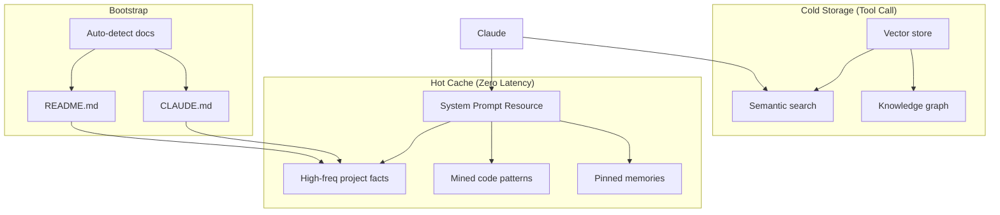

# Memory MCP - Project Instructions

## Core Value Proposition

**The Engram Insight**: Frequently-used patterns should be instantly available, not searched for.

This project differentiates from generic memory servers (like mcp-memory-service) through:

1. **Two-Tier Memory Architecture**
   - **Hot Cache**: Zero-latency access via MCP resource injection (no tool call needed)
   - **Cold Storage**: Semantic search for everything else

2. **Automatic Pattern Promotion**
   - Patterns accessed 3+ times auto-promote to hot cache
   - Stale patterns auto-demote after 14 days without access
   - Pin important memories to prevent auto-eviction

3. **Pattern Mining from Usage**
   - Extracts imports, commands, project facts from Claude's outputs
   - Frequency-based promotion candidates
   - Human approval before promotion

4. **Auto-Bootstrap**
   - Hot cache auto-populates from README.md, CLAUDE.md when empty
   - `bootstrap` CLI command and `bootstrap_project` MCP tool for manual seeding

5. **Knowledge Graph**
   - Link related memories with typed relationships
   - Relation types: `related_to`, `depends_on`, `contradicts`, `supersedes`, `derived_from`, `example_of`

6. **Trust Management**
   - Strengthen/weaken memory confidence over time
   - Trust decay for stale information

## Architecture



## Key Files

| File | Purpose |
|------|---------|
| `src/memory_mcp/server.py` | MCP tools and resources |
| `src/memory_mcp/storage.py` | SQLite + vector operations |
| `src/memory_mcp/mining.py` | Pattern extraction |
| `src/memory_mcp/cli.py` | CLI commands for hooks |
| `src/memory_mcp/config.py` | Settings and bootstrap file detection |
| `hooks/memory-log-response.sh` | Claude Code Stop hook |

## Recent Additions

- **Bootstrap**: `bootstrap_project` tool and `bootstrap` CLI command
- **Knowledge Graph**: `link_memories`, `unlink_memories`, `get_related_memories`
- **Trust Management**: `strengthen_trust`, `weaken_trust`
- **Session Tracking**: `get_or_create_session`, `get_session_memories`
- **Pin/Unpin**: `pin_memory`, `unpin_memory`

## Testing

```bash
uv run pytest -v              # All tests
uv run pytest -k hot          # Hot cache tests only
uv run pytest -k bootstrap    # Bootstrap tests
uv run pytest -k relationship # Knowledge graph tests
```

## When Working on This Project

- The hot cache is the differentiator - keep it simple and automatic
- Avoid adding features that don't serve the two-tier memory model
- If a feature requires manual user action, question whether it's worth it
- Test with real Claude Code usage, not just unit tests
