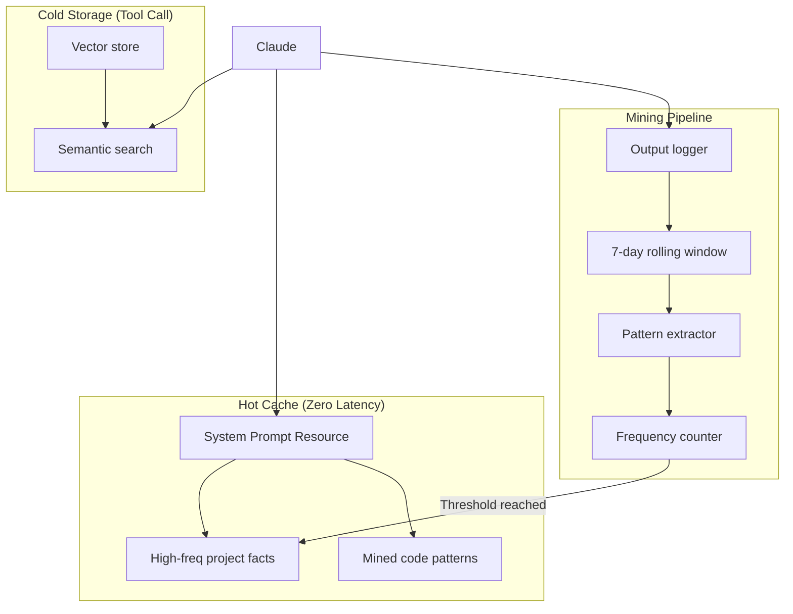

# Memory MCP Server

An Engram-inspired MCP server that gives Claude a "second brain" with:

- **Hot Cache**: Zero-latency access to frequently-used patterns (auto-injected via MCP resource)
- **Cold Storage**: Semantic search with confidence gating
- **Pattern Mining**: Automatic extraction from output logs with frequency-based promotion

## Architecture



## Installation

```bash
# Clone and install
git clone https://github.com/michael-denyer/memory-mcp.git
cd memory-mcp
uv sync

# Run tests
uv run pytest
```

## Claude Code Integration

Add to your Claude Code settings (`~/.claude.json` or project `.claude/settings.json`):

```json
{
  "mcpServers": {
    "memory": {
      "command": "uv",
      "args": ["run", "--directory", "/path/to/memory-mcp", "memory-mcp"]
    }
  }
}
```

Replace `/path/to/memory-mcp` with your actual installation path.

Restart Claude Code, then verify with `/mcp` - you should see the memory server's tools.

## Tools

### Cold Storage (Manual)

| Tool | Description |
|------|-------------|
| `remember(content, memory_type, tags)` | Store a memory |
| `recall(query, limit, threshold)` | Semantic search with confidence gating |
| `recall_by_tag(tag)` | Filter by tag |
| `forget(memory_id)` | Delete a memory |
| `list_memories(limit, offset, memory_type)` | Browse memories |
| `memory_stats()` | Get statistics |

### Hot Cache

| Tool | Description |
|------|-------------|
| `hot_cache_status()` | Show hot cache contents |
| `promote(memory_id)` | Manually promote to hot cache |
| `demote(memory_id)` | Remove from hot cache |

### Mining

| Tool | Description |
|------|-------------|
| `log_output(content)` | Log output for mining |
| `run_mining(hours)` | Extract patterns from logs |
| `mining_status()` | Show mining statistics |
| `review_candidates()` | Review patterns ready for promotion |
| `approve_candidate(pattern_id)` | Approve and promote pattern |
| `reject_candidate(pattern_id)` | Reject pattern |

## Memory Types

- `project` - Project-specific facts (architecture, conventions)
- `pattern` - Reusable code patterns
- `reference` - External docs, API notes
- `conversation` - Facts from discussions

## Confidence Gating

The `recall` tool returns results with confidence levels:

| Confidence | Similarity | Action |
|------------|------------|--------|
| `high` | > 0.85 | Use directly |
| `medium` | threshold - 0.85 | Verify context |
| `low` | < threshold | Reason from scratch |

Default threshold is 0.7 (configurable via `DEFAULT_CONFIDENCE_THRESHOLD`).

## Hot Cache Resource

The server exposes `memory://hot-cache` as an MCP resource. Configure Claude Code to auto-include this resource for zero-latency access to frequently-used knowledge.

## Configuration

Environment variables (prefix `MEMORY_MCP_`):

| Variable | Default | Description |
|----------|---------|-------------|
| `DB_PATH` | `~/.memory-mcp/memory.db` | Database location |
| `HOT_CACHE_MAX_ITEMS` | 20 | Max hot cache size |
| `PROMOTION_THRESHOLD` | 3 | Access count for auto-promotion |
| `DEMOTION_DAYS` | 14 | Days without access before demotion |
| `MINING_ENABLED` | true | Enable pattern mining |
| `LOG_RETENTION_DAYS` | 7 | Days to retain output logs |
| `DEFAULT_RECALL_LIMIT` | 5 | Default results per recall |
| `DEFAULT_CONFIDENCE_THRESHOLD` | 0.7 | Minimum similarity for results |
| `HIGH_CONFIDENCE_THRESHOLD` | 0.85 | Threshold for high confidence |
| `MAX_CONTENT_LENGTH` | 100000 | Max chars per memory/log |
| `MAX_RECALL_LIMIT` | 100 | Max results per recall |

## Example Usage

```
You: "Remember that this project uses PostgreSQL with pgvector"
Claude: [calls remember(..., memory_type="project")]
→ Stored as memory #1

You: "What database do we use?"
Claude: [calls recall("database configuration")]
→ {confidence: "high", memories: [{content: "This project uses PostgreSQL..."}]}

You: "Promote that to hot cache"
Claude: [calls promote(1)]
→ Memory #1 now in hot cache - zero latency access
```
