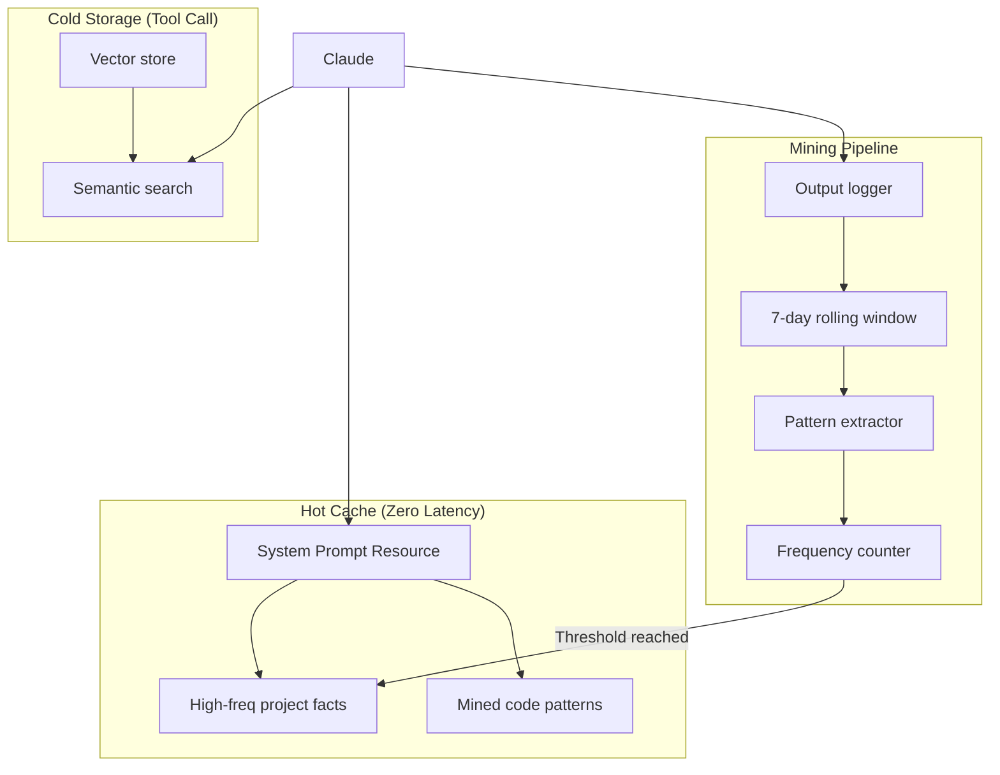

# Memory MCP Server

**Your AI assistant forgets everything when you start a new chat.** This MCP server gives Claude a persistent "second brain" with two-tier memory - frequently-used knowledge is always available (zero latency), while everything else is searchable on demand.

[](LICENSE)
[](https://www.python.org/downloads/)
[](https://claude.ai/claude-code)

## Why You Need This

| Without Memory MCP | With Memory MCP |
|-------------------|-----------------|
| Re-explain project architecture every session | Project facts persist across sessions |
| Repeat the same patterns manually | Frequently-used patterns auto-promoted to instant access |
| Context balloons to 500k+ tokens | Hot cache keeps system prompt lean (~20 items) |
| Tool calls for every memory lookup | Hot cache: **0ms** (already in context) |

**Inspired by [Engram](https://github.com/AnswerDotAI/engram)**: Frequently-used patterns should be instantly available, not searched every time.

## Quick Start (60 seconds)

```bash
# Clone and install
git clone https://github.com/michael-denyer/memory-mcp.git
cd memory-mcp && uv sync

# Add to Claude Code (~/.claude.json)
```

```json
{
  "mcpServers": {
    "memory": {
      "command": "uv",
      "args": ["run", "--directory", "/path/to/memory-mcp", "memory-mcp"]
    }
  }
}
```

Restart Claude Code. Verify with `/mcp` - you should see memory tools.

> **First run**: The embedding model (~90MB) downloads automatically. This adds 30-60 seconds to initial startup.

## Architecture



### Two-Tier Memory System

| Tier | Latency | How it works | What goes here |
|------|---------|--------------|----------------|
| **Hot Cache** | 0ms | Auto-injected via MCP resource | Project facts used 3+ times, pinned patterns |
| **Cold Storage** | ~50ms | Semantic search tool call | Everything else, searchable on demand |

Memories automatically promote to hot cache after 3 accesses (configurable). Stale memories demote after 14 days of non-use.

## Features

- **Persistent memory** - Survives across sessions, compaction events, IDE restarts
- **Semantic search** - Find memories by meaning, not just keywords
- **Confidence gating** - Results tagged high/medium/low confidence
- **Pattern mining** - Auto-extract patterns from Claude's outputs
- **Apple Silicon optimized** - MLX backend auto-detected on M-series Macs
- **Local-first** - All data in SQLite, no cloud dependency

## Tools Reference

### Memory Operations

| Tool | Description |
|------|-------------|
| `remember(content, type, tags)` | Store a memory with semantic embedding |
| `recall(query, limit, threshold)` | Semantic search with confidence gating |
| `recall_by_tag(tag)` | Filter memories by tag |
| `forget(memory_id)` | Delete a memory |
| `list_memories(limit, offset, type)` | Browse all memories |

### Hot Cache Management

| Tool | Description |
|------|-------------|
| `hot_cache_status()` | Show contents, metrics, and effectiveness |
| `promote(memory_id)` | Manually promote to hot cache |
| `demote(memory_id)` | Remove from hot cache (keeps in cold storage) |

### Pattern Mining

| Tool | Description |
|------|-------------|
| `log_output(content)` | Log content for pattern extraction |
| `run_mining(hours)` | Extract patterns from recent logs |
| `review_candidates()` | See patterns ready for promotion |
| `approve_candidate(id)` / `reject_candidate(id)` | Accept or reject patterns |

### Cold Start / Seeding

| Tool | Description |
|------|-------------|
| `seed_from_text(content, type, promote)` | Parse text into memories |
| `seed_from_file(path, type, promote)` | Import from file (e.g., CLAUDE.md) |

## Memory Types

| Type | Use for |
|------|---------|
| `project` | Architecture, conventions, tech stack |
| `pattern` | Reusable code patterns, commands |
| `reference` | API docs, external references |
| `conversation` | Facts from discussions |

## Confidence Gating

Recall results include confidence levels based on semantic similarity:

| Confidence | Similarity | Recommended action |
|------------|------------|-------------------|
| **high** | > 0.85 | Use directly |
| **medium** | 0.70 - 0.85 | Verify context |
| **low** | < 0.70 | Reason from scratch |

## Configuration

Environment variables (prefix `MEMORY_MCP_`):

### Core Settings

| Variable | Default | Description |
|----------|---------|-------------|
| `DB_PATH` | `~/.memory-mcp/memory.db` | SQLite database location |
| `EMBEDDING_MODEL` | `all-MiniLM-L6-v2` | Sentence transformer model |
| `EMBEDDING_BACKEND` | `auto` | `auto`, `mlx`, or `sentence-transformers` |

### Hot Cache

| Variable | Default | Description |
|----------|---------|-------------|
| `HOT_CACHE_MAX_ITEMS` | `20` | Maximum items in hot cache |
| `PROMOTION_THRESHOLD` | `3` | Access count for auto-promotion |
| `DEMOTION_DAYS` | `14` | Days without access before demotion |
| `AUTO_PROMOTE` | `true` | Enable automatic promotion |
| `AUTO_DEMOTE` | `true` | Enable automatic demotion |

### Retrieval

| Variable | Default | Description |
|----------|---------|-------------|
| `DEFAULT_RECALL_LIMIT` | `5` | Default results per recall |
| `DEFAULT_CONFIDENCE_THRESHOLD` | `0.7` | Minimum similarity for results |
| `HIGH_CONFIDENCE_THRESHOLD` | `0.85` | Threshold for "high" confidence |

## Hot Cache Resource

The server exposes `memory://hot-cache` as an MCP resource. Hot cache contents are automatically available in Claude's context without tool calls.

### Enabling Auto-Injection

Add the MCP server to your settings (see Quick Start). The hot cache resource is automatically available. Verify with `/mcp` in Claude Code.

### How It Works

1. Memories promoted to hot cache appear in `memory://hot-cache`
2. Claude sees hot cache contents without needing tool calls
3. Keeps system prompts lean (~10-20 items max)
4. Contents update as you promote/demote memories

## Automatic Output Logging

For pattern mining to work automatically, install the Claude Code hook.

### Prerequisites

The hook script requires `jq` for JSON parsing:

```bash
# macOS
brew install jq

# Ubuntu/Debian
sudo apt install jq
```

### Installation

```bash
chmod +x hooks/memory-log-response.sh
```

Add to `~/.claude/settings.json`:

```json
{
  "hooks": {
    "Stop": [{
      "hooks": [{
        "type": "command",
        "command": "/path/to/memory-mcp/hooks/memory-log-response.sh"
      }]
    }]
  }
}
```

## CLI Commands

```bash
# Log content for mining
echo "Some content" | uv run memory-mcp-cli log-output

# Run pattern extraction
uv run memory-mcp-cli run-mining --hours 24

# Seed from a file
uv run memory-mcp-cli seed ~/project/CLAUDE.md -t project --promote
```

## Development

```bash
# Run tests
uv run pytest -v

# Run with debug logging
uv run memory-mcp 2>&1 | head -50
```

### Resource Usage

| Resource | Typical |
|----------|---------|
| Disk | 1-10 MB |
| Memory | 200-400 MB (embedding model) |
| Startup | 2-5 seconds (after model cached) |

## Example Usage

```
You: "Remember that this project uses PostgreSQL with pgvector"
Claude: [calls remember(..., memory_type="project")]
→ Stored as memory #1

You: "What database do we use?"
Claude: [calls recall("database configuration")]
→ {confidence: "high", memories: [{content: "PostgreSQL with pgvector..."}]}

You: "Promote that to hot cache"
Claude: [calls promote(1)]
→ Memory #1 now in hot cache - available instantly next session
```

## Security Note

This server is designed for **local use only**. It runs unauthenticated over STDIO transport and should not be exposed to networks or untrusted clients.

## License

MIT
