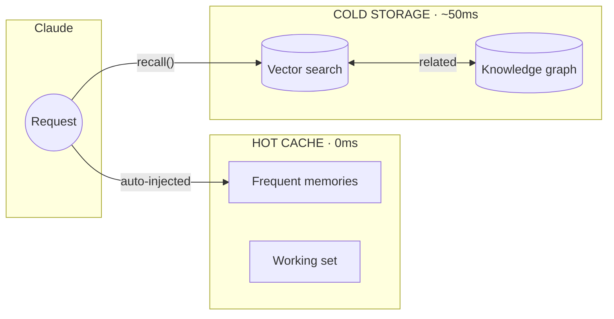

<!-- mcp-name: io.github.michael-denyer/hot-memory-mcp -->
<div align="center">

# 🧠 Memory MCP

### Give your AI assistant a persistent second brain

[](LICENSE)
[](https://www.python.org/downloads/)
[](https://modelcontextprotocol.io)
[](https://claude.ai/code)
[](https://pypi.org/project/hot-memory-mcp/)

<br />

**Stop re-explaining your project every session.**

Memory MCP learns what matters and keeps it ready — instant recall for the stuff you use most, semantic search for everything else.

</div>

---

## The Problem

Every new chat starts from scratch. You explain your architecture *again*. You paste the same patterns *again*. Your context window bloats with repetition.

Other memory solutions help, but they still require tool calls for every lookup — adding latency and eating into Claude's thinking budget.

**Memory MCP fixes this with a two-tier architecture:**

1. **Hot cache (0ms)** — Frequently-used knowledge auto-injected into context *before Claude even starts thinking*. No tool call needed.
2. **Cold storage (~50ms)** — Everything else, searchable by meaning via semantic similarity.

The system learns what you use and promotes it automatically. Your most valuable knowledge becomes instantly available. No manual curation required.

## Before & After

| 😤 Without Memory MCP | 🎯 With Memory MCP |
|----------------------|-------------------|
| "Let me explain our architecture again..." | Project facts persist and isolate per repo |
| Copy-paste the same patterns every session | Patterns auto-promoted to instant access |
| 500k+ token context windows | Hot cache keeps it lean (~20 items) |
| Tool call latency on every memory lookup | Hot cache: **0ms** — already in context |
| Stale information lingers forever | Trust scoring demotes outdated facts |
| Flat list of disconnected facts | Knowledge graph connects related concepts |

## Install

```bash
# Install package
uv tool install hot-memory-mcp   # or: pip install hot-memory-mcp

# Add plugin (recommended)
claude plugins add michael-denyer/memory-mcp
```

The plugin gives you auto-configured hooks, slash commands, and the Memory Analyst agent.

<details>
<summary>Manual config (no plugin)</summary>

Add to `~/.claude.json`:

```json
{
  "mcpServers": {
    "memory": {
      "command": "memory-mcp"
    }
  }
}
```
</details>

<details>
<summary>Apple Silicon optimization</summary>

Add MLX support for faster embeddings:
```bash
uv tool install hot-memory-mcp[mlx]
```
</details>

Restart Claude Code. The hot cache auto-populates from your project docs.

> **First run**: Embedding model (~90MB) downloads automatically. Takes 30-60 seconds once.

## How It Works



| Tier | Latency | Behavior |
|------|---------|----------|
| **Hot Cache** | 0ms | Auto-injected every request. No tool call needed. |
| **Cold Storage** | ~50ms | Semantic search when you need deeper recall. |

Memories used 3+ times auto-promote to hot cache. Unused memories demote after 14 days. Pin important ones to keep them hot forever.

## What Makes It Different

Most memory systems make you pay a tool-call tax on every lookup. Memory MCP's **hot cache bypasses this entirely** — your most-used knowledge is already in context when Claude starts thinking.

| | Memory MCP | Generic Memory Servers |
|---|------------|------------------------|
| **Hot cache** | Auto-injected at 0ms | Every lookup = tool call |
| **Self-organizing** | Learns and promotes automatically | Manual curation required |
| **Project-aware** | Auto-isolates by git repo | One big pile of memories |
| **Knowledge graph** | Multi-hop recall across concepts | Flat list of facts |
| **Pattern mining** | Learns from Claude's outputs | Not available |
| **Trust scoring** | Outdated info decays and sinks | All memories equal |
| **Setup** | One command, local SQLite | Often needs cloud setup |

**The Engram Insight**: Human memory doesn't search — frequently-used patterns are *already there*. That's what hot cache does for Claude.

## Features

- **Instant recall** — Hot cache bypasses tool calls entirely
- **Self-organizing** — Learns what you use, promotes automatically
- **Project-aware** — Memories auto-tagged by git repo
- **Knowledge graph** — Link related concepts, multi-hop recall
- **Pattern mining** — Learns from Claude's outputs
- **Trust scoring** — Outdated info decays and sinks
- **Local & private** — SQLite, no cloud, works offline
- **Apple Silicon** — MLX auto-detected on M-series Macs

## Quick Reference

### Slash Commands (with plugin)

| Command | Description |
|---------|-------------|
| `/memory-mcp:remember` | Store a memory |
| `/memory-mcp:recall` | Search memories |
| `/memory-mcp:hot-cache` | Manage hot cache |
| `/memory-mcp:stats` | Show statistics |
| `/memory-mcp:bootstrap` | Seed from project docs |

### Core Tools

```
remember(content, type, tags)  → Store
recall(query)                  → Search
promote(id) / demote(id)       → Hot cache
link_memories(from, to, type)  → Knowledge graph
```

### CLI

```bash
memory-mcp-cli bootstrap    # Seed from project docs
memory-mcp-cli status       # Show stats
memory-mcp-cli dashboard    # Web UI at :8765
memory-mcp-cli consolidate  # Merge duplicates
memory-mcp-cli hook-check   # Verify hook dependencies
```

## Documentation

| Document | Description |
|----------|-------------|
| [Reference](docs/REFERENCE.md) | Full API, configuration, MCP resources |
| [Troubleshooting](docs/TROUBLESHOOTING.md) | Common issues and solutions |

## Development

```bash
git clone https://github.com/michael-denyer/memory-mcp.git
cd memory-mcp && uv sync
uv run pytest -v  # 658 tests
```

| Requirement | Value |
|-------------|-------|
| Python | 3.10+ |
| First run | ~60s (model download) |
| Startup | 2-5s |

## License

MIT
