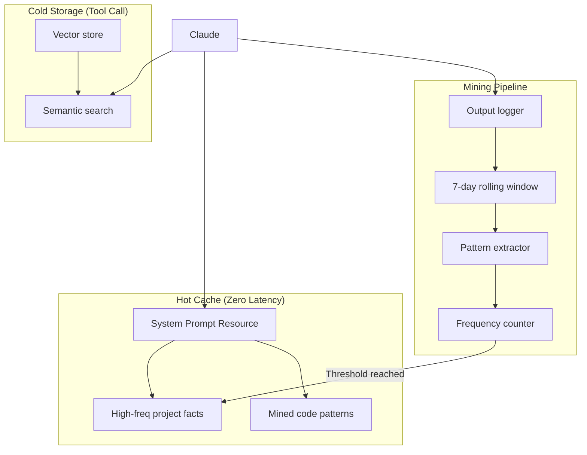

# Memory MCP Server

An Engram-inspired MCP server that gives Claude a "second brain" with:

- **Hot Cache**: Zero-latency access to frequently-used patterns (auto-injected via MCP resource)
- **Cold Storage**: Semantic search with confidence gating
- **Pattern Mining**: Automatic extraction from output logs with frequency-based promotion

> **Security Note**: This server is designed for **local use only**. It runs unauthenticated over STDIO transport and should not be exposed to networks or untrusted clients.

## Architecture



## Requirements

- Python 3.10+
- [uv](https://docs.astral.sh/uv/) package manager

### Dependencies

Core dependencies (installed automatically):
- `fastmcp>=2.0,<3` - MCP server framework
- `sqlite-vec>=0.1` - Vector similarity search extension
- `sentence-transformers>=3.0` - Embedding model
- `pydantic>=2.0` / `pydantic-settings>=2.0` - Configuration
- `loguru>=0.7` - Logging

### First Run

On first run, the embedding model (~90MB) downloads automatically from Hugging Face. This may add 30-60 seconds to initial startup depending on your connection.

## Installation

```bash
# Clone the repository
git clone https://github.com/michael-denyer/memory-mcp.git
cd memory-mcp

# Install dependencies
uv sync

# Run tests to verify installation
uv run pytest

# Optional: Pre-download the embedding model
uv run python -c "from sentence_transformers import SentenceTransformer; SentenceTransformer('sentence-transformers/all-MiniLM-L6-v2')"
```

## Claude Code Integration

Add to your Claude Code settings (`~/.claude.json` or project `.claude/settings.json`):

```json
{
  "mcpServers": {
    "memory": {
      "command": "uv",
      "args": ["run", "--directory", "<path-to-memory-mcp>", "memory-mcp"]
    }
  }
}
```

Replace `<path-to-memory-mcp>` with the absolute path where you cloned the repository.

Restart Claude Code, then verify with `/mcp` - you should see the memory server's tools.

## Tools

### Cold Storage (Manual)

| Tool | Description |
|------|-------------|
| `remember(content, memory_type, tags)` | Store a memory |
| `recall(query, limit, threshold)` | Semantic search with confidence gating |
| `recall_by_tag(tag)` | Filter by tag |
| `forget(memory_id)` | Delete a memory |
| `list_memories(limit, offset, memory_type)` | Browse memories |
| `memory_stats()` | Get statistics |

### Hot Cache

| Tool | Description |
|------|-------------|
| `hot_cache_status()` | Show hot cache contents |
| `promote(memory_id)` | Manually promote to hot cache |
| `demote(memory_id)` | Remove from hot cache |

### Mining

| Tool | Description |
|------|-------------|
| `log_output(content)` | Log output for mining |
| `run_mining(hours)` | Extract patterns from logs |
| `mining_status()` | Show mining statistics |
| `review_candidates()` | Review patterns ready for promotion |
| `approve_candidate(pattern_id)` | Approve and promote pattern |
| `reject_candidate(pattern_id)` | Reject pattern |

### Seeding (Cold Start)

| Tool | Description |
|------|-------------|
| `seed_from_text(content, type, promote)` | Parse text and create memories |
| `seed_from_file(path, type, promote)` | Import from file (e.g., CLAUDE.md) |

### Maintenance

| Tool | Description |
|------|-------------|
| `db_info()` | Get database info (path, size, schema version) |
| `db_maintenance()` | Run vacuum and analyze, reclaim space |
| `embedding_info()` | Get embedding provider and cache stats |

## Memory Types

- `project` - Project-specific facts (architecture, conventions)
- `pattern` - Reusable code patterns
- `reference` - External docs, API notes
- `conversation` - Facts from discussions

## Confidence Gating

The `recall` tool returns results with confidence levels:

| Confidence | Similarity | Action |
|------------|------------|--------|
| `high` | > 0.85 | Use directly |
| `medium` | 0.7 - 0.85 | Verify context |
| `low` | < 0.7 | Reason from scratch |

Default threshold is 0.7 (configurable via `DEFAULT_CONFIDENCE_THRESHOLD`).

## Hot Cache Resource

The server exposes `memory://hot-cache` as an MCP resource for zero-latency access to frequently-used knowledge.

### Enabling Auto-Injection

To have hot cache contents automatically included in Claude's context, configure the resource in your settings:

1. **Find your settings file**:
   - Global: `~/.claude/settings.json`
   - Project: `.claude/settings.json`

2. **Add the resource configuration**:

```json
{
  "mcpServers": {
    "memory": {
      "command": "uv",
      "args": ["run", "--directory", "<path-to-memory-mcp>", "memory-mcp"]
    }
  }
}
```

3. **Verify in Claude Code**:
   - Run `/mcp` to see available resources
   - The `memory://hot-cache` resource should be listed

### How It Works

- Memories promoted to hot cache appear in this resource
- Contents update as you promote/demote memories
- Claude sees hot cache contents without needing tool calls
- Keeps system prompts lean (~10-20 items max)

## Automatic Output Logging

For the mining pipeline to work automatically, install the Claude Code hook that logs responses:

### Hook Installation

1. **Make the hook script executable** (already done if you cloned):
   ```bash
   chmod +x hooks/memory-log-response.sh
   ```

2. **Add to your Claude Code settings** (`~/.claude/settings.json`):

```json
{
  "hooks": {
    "Stop": [
      {
        "hooks": [
          {
            "type": "command",
            "command": "<path-to-memory-mcp>/hooks/memory-log-response.sh"
          }
        ]
      }
    ]
  }
}
```

Replace `<path-to-memory-mcp>` with the absolute path to your memory-mcp installation.

3. **Restart Claude Code** for hooks to take effect.

### What Gets Logged

- Claude's text responses (after each conversation turn)
- Responses shorter than 50 characters are skipped (acknowledgments)
- Content is stored in the 7-day rolling output log
- Run `run_mining()` to extract patterns from logs

### CLI Commands

You can also log content manually or run mining from the command line:

```bash
# Log content from stdin
echo "Some content to analyze" | uv run memory-mcp-cli log-output

# Log content from a file
uv run memory-mcp-cli log-output -f output.txt

# Run mining on recent logs
uv run memory-mcp-cli run-mining --hours 24

# Output as JSON
uv run memory-mcp-cli --json log-output -c "Content here"

# Seed memories from a file (cold start)
uv run memory-mcp-cli seed ~/project/CLAUDE.md

# Seed with specific type and promote to hot cache
uv run memory-mcp-cli seed notes.md -t project --promote
```

## Configuration

Environment variables (prefix `MEMORY_MCP_`):

### Database & Storage

| Variable | Default | Description |
|----------|---------|-------------|
| `DB_PATH` | `~/.memory-mcp/memory.db` | SQLite database location |

### Embeddings

| Variable | Default | Description |
|----------|---------|-------------|
| `EMBEDDING_MODEL` | `sentence-transformers/all-MiniLM-L6-v2` | Sentence transformer model |
| `EMBEDDING_DIM` | `384` | Embedding vector dimension (must match model) |

> **Warning**: Changing `EMBEDDING_DIM` after creating memories will cause retrieval failures. Delete the database or migrate if changing models.

### Hot Cache

| Variable | Default | Description |
|----------|---------|-------------|
| `HOT_CACHE_MAX_ITEMS` | `20` | Maximum items in hot cache |
| `PROMOTION_THRESHOLD` | `3` | Access count for auto-promotion |
| `DEMOTION_DAYS` | `14` | Days without access before demotion |

### Mining

| Variable | Default | Description |
|----------|---------|-------------|
| `MINING_ENABLED` | `true` | Enable pattern mining |
| `LOG_RETENTION_DAYS` | `7` | Days to retain output logs |

### Retrieval

| Variable | Default | Description |
|----------|---------|-------------|
| `DEFAULT_RECALL_LIMIT` | `5` | Default results per recall |
| `DEFAULT_CONFIDENCE_THRESHOLD` | `0.7` | Minimum similarity for results |
| `HIGH_CONFIDENCE_THRESHOLD` | `0.85` | Threshold for high confidence |

### Input Limits

| Variable | Default | Description |
|----------|---------|-------------|
| `MAX_CONTENT_LENGTH` | `100000` | Max characters per memory/log |
| `MAX_RECALL_LIMIT` | `100` | Max results per recall query |
| `MAX_TAGS` | `20` | Max tags per memory |

## Data Persistence

### Database Location

By default, the SQLite database is stored at `~/.memory-mcp/memory.db`. The directory is created automatically on first run.

### Backups

```bash
# Backup the database
cp ~/.memory-mcp/memory.db ~/.memory-mcp/memory.db.backup

# Restore from backup
cp ~/.memory-mcp/memory.db.backup ~/.memory-mcp/memory.db
```

### Changing Embedding Models

If you change `EMBEDDING_MODEL` or `EMBEDDING_DIM`, existing embeddings become incompatible. Options:

1. **Delete and rebuild** (recommended for small datasets):
   ```bash
   rm ~/.memory-mcp/memory.db
   # Re-add memories after restart
   ```

2. **Use a separate database**:
   ```bash
   export MEMORY_MCP_DB_PATH=~/.memory-mcp/memory-new-model.db
   ```

## Development

### Running Tests

```bash
uv run pytest -v
```

### Running with Debug Logging

The server logs to stderr (required for STDIO MCP transport):

```bash
# Run directly with visible logs
uv run memory-mcp 2>&1 | head -50
```

### Resource Usage

- **Disk**: ~1-10 MB typical (depends on memory count)
- **Memory**: ~200-400 MB (embedding model loaded in memory)
- **Startup**: 2-5 seconds (after model is cached)

## Example Usage

```
You: "Remember that this project uses PostgreSQL with pgvector"
Claude: [calls remember(..., memory_type="project")]
→ Stored as memory #1

You: "What database do we use?"
Claude: [calls recall("database configuration")]
→ {confidence: "high", memories: [{content: "This project uses PostgreSQL..."}]}

You: "Promote that to hot cache"
Claude: [calls promote(1)]
→ Memory #1 now in hot cache - zero latency access
```

### Detailed Workflows

- [Project Onboarding](docs/examples/project-onboarding.md) - Store and retrieve project facts
- [Cross-Session Continuity](docs/examples/cross-session-continuity.md) - Preserve decisions across sessions
- [Pattern Mining](docs/examples/pattern-mining.md) - Auto-extract frequently-used patterns

## License

MIT
