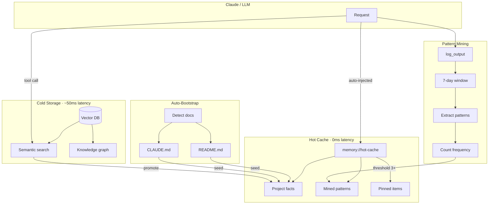

# Memory MCP Server

**Your AI assistant forgets everything when you start a new chat.** This MCP server gives Claude a persistent "second brain" with two-tier memory - frequently-used knowledge is always available (zero latency), while everything else is searchable on demand.

[](LICENSE)
[](https://www.python.org/downloads/)
[](https://claude.ai/claude-code)

## Why You Need This

| Without Memory MCP | With Memory MCP |
|-------------------|-----------------|
| Re-explain project architecture every session | Project facts persist across sessions |
| Repeat the same patterns manually | Frequently-used patterns auto-promoted to instant access |
| Context balloons to 500k+ tokens | Hot cache keeps system prompt lean (~20 items) |
| Tool calls for every memory lookup | Hot cache: **0ms** (already in context) |

**Inspired by Engram**: Frequently-used patterns should be instantly available, not searched every time.

## Quick Start (60 seconds)

```bash
# Clone and install
git clone https://github.com/michael-denyer/memory-mcp.git
cd memory-mcp && uv sync

# Add to Claude Code (~/.claude.json)
```

```json
{
  "mcpServers": {
    "memory": {
      "command": "uv",
      "args": ["run", "--directory", "/path/to/memory-mcp", "memory-mcp"]
    }
  }
}
```

Restart Claude Code. Verify with `/mcp` - you should see memory tools.

> **First run**: The embedding model (~90MB) downloads automatically. This adds 30-60 seconds to initial startup.

## Architecture



### Two-Tier Memory System

| Tier | Latency | How it works | What goes here |
|------|---------|--------------|----------------|
| **Hot Cache** | 0ms | Auto-injected via MCP resource | Project facts used 3+ times, pinned patterns |
| **Cold Storage** | ~50ms | Semantic search tool call | Everything else, searchable on demand |

Memories automatically promote to hot cache after 3 accesses (configurable). Stale memories demote after 14 days of non-use.

## Features

- **Persistent memory** - Survives across sessions, compaction events, IDE restarts
- **Semantic search** - Find memories by meaning, not just keywords
- **Auto-bootstrap** - Hot cache auto-populates from README.md, CLAUDE.md when empty
- **Knowledge graph** - Link related memories with typed relationships
- **Multi-hop recall** - Traverse knowledge graph to find associated memories
- **Episodic memory** - Session-bound short-term context with consolidation to long-term
- **Confidence gating** - Results tagged high/medium/low confidence
- **Trust management** - Strengthen/weaken memory confidence over time
- **Salience scoring** - Unified metric combining importance, trust, access, and recency
- **Pattern mining** - Auto-extract patterns from Claude's outputs
- **Memory consolidation** - Merge semantically similar memories to reduce redundancy
- **Apple Silicon optimized** - MLX backend auto-detected on M-series Macs
- **Local-first** - All data in SQLite, no cloud dependency

## How This Compares

| Capability | Memory MCP | Other options |
|------------|------------|---------------|
| MCP-native resource | Hot cache exposed as `memory://hot-cache`, auto-injected, 0ms lookup | Most are pull-only search; file configs (claude.md, cline/kilo) require manual reads; vector DBs need wrappers |
| Auto promotion/demotion | Access-count and recency-based tiering between hot cache and vector store | Generally manual or TTL-based; Letta has policies but not a two-tier cache |
| Pattern mining | Mines Claude outputs into reusable patterns and promotes them | Not present in Byterover, Zep, Mem0, vector DBs, LangChain/LlamaIndex |
| Local-first setup | Single `uv run memory-mcp`, ~90MB model, SQLite | Vector DBs require external services; Byterover/Zep/Letta are heavier to deploy; file configs are light but lack semantic search |
| Hardware awareness | MLX auto-detect on Apple Silicon | Most are backend-agnostic without local M-series optimizations |
| Team and scale | Single-user/local focus | Byterover offers Git-like team memory; vector DBs (Pinecone/Weaviate/Milvus/pgvector) win on distributed scale |
| Built-in summarization | Embedding-based recall with hot cache | Zep includes summarization pipelines; vector DBs/LangChain/LlamaIndex rely on added chains |

## Tools Reference

### Memory Operations

| Tool | Description |
|------|-------------|
| `remember(content, type, tags)` | Store a memory with semantic embedding |
| `recall(query, limit, threshold, expand_relations)` | Semantic search with confidence gating and optional multi-hop expansion |
| `recall_by_tag(tag)` | Filter memories by tag |
| `forget(memory_id)` | Delete a memory |
| `list_memories(limit, offset, type)` | Browse all memories |

### Hot Cache Management

| Tool | Description |
|------|-------------|
| `hot_cache_status()` | Show contents, metrics, and effectiveness |
| `promote(memory_id)` | Manually promote to hot cache |
| `demote(memory_id)` | Remove from hot cache (keeps in cold storage) |
| `pin_memory(memory_id)` | Pin memory (prevents auto-eviction) |
| `unpin_memory(memory_id)` | Unpin memory (allows auto-eviction) |

### Pattern Mining

| Tool | Description |
|------|-------------|
| `log_output(content)` | Log content for pattern extraction |
| `run_mining(hours)` | Extract patterns from recent logs |
| `review_candidates()` | See patterns ready for promotion |
| `approve_candidate(id)` / `reject_candidate(id)` | Accept or reject patterns |

### Cold Start / Seeding

| Tool | Description |
|------|-------------|
| `bootstrap_project(root, files, promote)` | Auto-detect and seed from project docs (README.md, CLAUDE.md, etc.) |
| `seed_from_text(content, type, promote)` | Parse text into memories |
| `seed_from_file(path, type, promote)` | Import from file (e.g., CLAUDE.md) |

### Knowledge Graph

| Tool | Description |
|------|-------------|
| `link_memories(from_id, to_id, relation, metadata)` | Create relationship between memories |
| `unlink_memories(from_id, to_id, relation)` | Remove relationship(s) |
| `get_related_memories(memory_id, relation, direction)` | Find connected memories |

Relation types: `related_to`, `depends_on`, `contradicts`, `supersedes`, `derived_from`, `example_of`

### Trust Management

| Tool | Description |
|------|-------------|
| `strengthen_trust(memory_id, amount, reason)` | Increase confidence in a memory |
| `weaken_trust(memory_id, amount, reason)` | Decrease confidence (e.g., found outdated) |

### Session Tracking

| Tool | Description |
|------|-------------|
| `get_or_create_session(session_id, topic)` | Track conversation context |
| `get_session_memories(session_id)` | Retrieve memories from a session |
| `end_session(session_id, promote_top)` | End session and promote top episodic memories to long-term storage |

## Memory Types

| Type | Use for |
|------|---------|
| `project` | Architecture, conventions, tech stack |
| `pattern` | Reusable code patterns, commands |
| `reference` | API docs, external references |
| `conversation` | Facts from discussions |
| `episodic` | Session-bound short-term context (auto-expires after 7 days) |

## Confidence Gating

Recall results include confidence levels based on semantic similarity:

| Confidence | Similarity | Recommended action |
|------------|------------|-------------------|
| **high** | > 0.85 | Use directly |
| **medium** | 0.70 - 0.85 | Verify context |
| **low** | < 0.70 | Reason from scratch |

## Configuration

Environment variables (prefix `MEMORY_MCP_`):

### Core Settings

| Variable | Default | Description |
|----------|---------|-------------|
| `DB_PATH` | `~/.memory-mcp/memory.db` | SQLite database location |
| `EMBEDDING_MODEL` | `all-MiniLM-L6-v2` | Sentence transformer model |
| `EMBEDDING_BACKEND` | `auto` | `auto`, `mlx`, or `sentence-transformers` |

### Hot Cache

| Variable | Default | Description |
|----------|---------|-------------|
| `HOT_CACHE_MAX_ITEMS` | `20` | Maximum items in hot cache |
| `PROMOTION_THRESHOLD` | `3` | Access count for auto-promotion |
| `DEMOTION_DAYS` | `14` | Days without access before demotion |
| `AUTO_PROMOTE` | `true` | Enable automatic promotion |
| `AUTO_DEMOTE` | `true` | Enable automatic demotion |

### Retrieval

| Variable | Default | Description |
|----------|---------|-------------|
| `DEFAULT_RECALL_LIMIT` | `5` | Default results per recall |
| `DEFAULT_CONFIDENCE_THRESHOLD` | `0.7` | Minimum similarity for results |
| `HIGH_CONFIDENCE_THRESHOLD` | `0.85` | Threshold for "high" confidence |
| `RECALL_EXPAND_RELATIONS` | `false` | Enable multi-hop recall via knowledge graph |

### Salience & Promotion

| Variable | Default | Description |
|----------|---------|-------------|
| `SALIENCE_PROMOTION_THRESHOLD` | `0.5` | Minimum salience score for auto-promotion |
| `SALIENCE_IMPORTANCE_WEIGHT` | `0.25` | Weight for importance in salience |
| `SALIENCE_TRUST_WEIGHT` | `0.25` | Weight for trust in salience |
| `SALIENCE_ACCESS_WEIGHT` | `0.25` | Weight for access count in salience |
| `SALIENCE_RECENCY_WEIGHT` | `0.25` | Weight for recency in salience |

### Episodic Memory

| Variable | Default | Description |
|----------|---------|-------------|
| `EPISODIC_PROMOTE_TOP_N` | `3` | Top N episodic memories to promote on session end |
| `EPISODIC_PROMOTE_THRESHOLD` | `0.6` | Minimum salience for episodic promotion |
| `RETENTION_EPISODIC_DAYS` | `7` | Days to retain episodic memories |

### Working Set

| Variable | Default | Description |
|----------|---------|-------------|
| `WORKING_SET_ENABLED` | `true` | Enable memory://working-set resource |
| `WORKING_SET_MAX_ITEMS` | `10` | Maximum items in working set |

## MCP Resources

The server exposes two MCP resources for zero-latency memory access:

### Hot Cache (`memory://hot-cache`)

Auto-injectable system context with high-confidence patterns. Contents are automatically available in Claude's context without tool calls.

- Memories promoted to hot cache appear here
- Keeps system prompts lean (~10-20 items max)
- **Auto-bootstrap**: If empty, auto-seeds from project docs (README.md, CLAUDE.md, etc.)

### Working Set (`memory://working-set`)

Session-aware active memory context (Engram-inspired). Provides contextually relevant memories:

1. Recently recalled memories (that were actually used)
2. Predicted next memories (from access pattern learning)
3. Top salience hot items (to fill remaining slots)

Smaller and more focused than hot-cache (~10 items) - designed for active work context.

### Enabling Auto-Injection

Add the MCP server to your settings (see Quick Start). Both resources are automatically available. Verify with `/mcp` in Claude Code.

## Automatic Output Logging

For pattern mining to work automatically, install the Claude Code hook.

### Prerequisites

The hook script requires `jq` for JSON parsing:

```bash
# macOS
brew install jq

# Ubuntu/Debian
sudo apt install jq
```

### Installation

```bash
chmod +x hooks/memory-log-response.sh
```

Add to `~/.claude/settings.json`:

```json
{
  "hooks": {
    "Stop": [{
      "hooks": [{
        "type": "command",
        "command": "/path/to/memory-mcp/hooks/memory-log-response.sh"
      }]
    }]
  }
}
```

## CLI Commands

```bash
# Bootstrap hot cache from project docs (auto-detects README.md, CLAUDE.md, etc.)
uv run memory-mcp-cli bootstrap

# Bootstrap from specific directory
uv run memory-mcp-cli bootstrap -r /path/to/project

# Bootstrap specific files only
uv run memory-mcp-cli bootstrap -f README.md -f ARCHITECTURE.md

# Log content for mining
echo "Some content" | uv run memory-mcp-cli log-output

# Run pattern extraction
uv run memory-mcp-cli run-mining --hours 24

# Seed from a file
uv run memory-mcp-cli seed ~/project/CLAUDE.md -t project --promote

# Consolidate similar memories (preview first with --dry-run)
uv run memory-mcp-cli consolidate --dry-run
uv run memory-mcp-cli consolidate

# Show memory system status
uv run memory-mcp-cli status
```

## Development

```bash
# Run tests
uv run pytest -v

# Run with debug logging
uv run memory-mcp 2>&1 | head -50
```

### System Requirements

| Requirement | Minimum | Notes |
|-------------|---------|-------|
| Python | 3.10+ | 3.11+ recommended for performance |
| Disk | ~2-3 GB | Dependencies (~2GB) + embedding model (~90MB) + database |
| RAM | 200-400 MB | During embedding operations |
| First Run | 30-60 seconds | One-time ~90MB model download |
| Startup | 2-5 seconds | After model is cached |

**Apple Silicon Users**: Install with MLX support for faster embeddings:
```bash
pip install memory-mcp[mlx]
```

## Example Usage

```
You: "Remember that this project uses PostgreSQL with pgvector"
Claude: [calls remember(..., memory_type="project")]
→ Stored as memory #1

You: "What database do we use?"
Claude: [calls recall("database configuration")]
→ {confidence: "high", memories: [{content: "PostgreSQL with pgvector..."}]}

You: "Promote that to hot cache"
Claude: [calls promote(1)]
→ Memory #1 now in hot cache - available instantly next session
```

## Troubleshooting

### Server Won't Start

**Symptom**: Claude Code shows "memory" server as disconnected

1. **Check the command works directly**:
   ```bash
   cd /path/to/memory-mcp
   uv run memory-mcp
   ```

2. **Verify path in `~/.claude.json`**: The `--directory` path must be absolute

3. **Check Python version**: Requires 3.10+
   ```bash
   python --version
   ```

### Dimension Mismatch Error

**Symptom**: `Vector dimension mismatch` error during recall

This happens when the embedding model changes. Rebuild vectors:

```bash
uv run memory-mcp-cli db-rebuild-vectors
```

### Hot Cache Not Updating

**Symptom**: Promoted memories don't appear in hot cache

1. **Check hot cache status**:
   ```bash
   uv run memory-mcp-cli status
   ```

2. **Verify memory exists**:
   ```
   [In Claude] list_memories(limit=10)
   ```

3. **Manually promote**:
   ```
   [In Claude] promote(memory_id)
   ```

### Pattern Mining Not Working

**Symptom**: `run_mining` finds no patterns

1. **Check mining is enabled**:
   ```bash
   echo $MEMORY_MCP_MINING_ENABLED  # Should not be "false"
   ```

2. **Verify logs exist**:
   ```bash
   uv run memory-mcp-cli run-mining --hours 24
   ```

3. **Check hook is installed** (see [Automatic Output Logging](#automatic-output-logging))

### Hook Script Fails

**Symptom**: Hook runs but nothing is logged

1. **Check jq is installed**:
   ```bash
   which jq  # Should return a path
   ```

2. **Make script executable**:
   ```bash
   chmod +x hooks/memory-log-response.sh
   ```

3. **Test manually**:
   ```bash
   echo "test content" | uv run memory-mcp-cli log-output
   ```

### Slow First Startup

**Symptom**: First run takes 30-60 seconds

This is expected - the embedding model (~90MB) downloads on first use. Subsequent starts take 2-5 seconds.

### Database Corruption

**Symptom**: SQLite errors or unexpected behavior

1. **Backup and recreate**:
   ```bash
   mv ~/.memory-mcp/memory.db ~/.memory-mcp/memory.db.bak
   # Server will create fresh database on next start
   ```

2. **Re-bootstrap from project docs**:
   ```bash
   uv run memory-mcp-cli bootstrap
   ```

## Security Note

This server is designed for **local use only**. It runs unauthenticated over STDIO transport and should not be exposed to networks or untrusted clients.

## License

MIT
